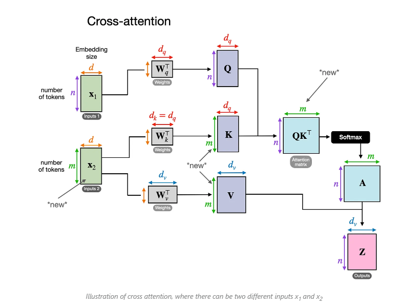

# 什么是Cross Attention（交叉注意力）？（特征融合！！！）详细解析与应用

- 在深度学习领域，尤其是自然语言处理（NLP）和计算机视觉（CV）中，注意力机制（Attention Mechanism）已经成为许多模型的核心组件，比如Transformer。我们熟知的Self-Attention（自注意力）让模型能够关注输入序列中不同位置之间的关系，但今天我们要聊的是一个更灵活、更强大的变体——Cross Attention（交叉注意力）。那么，Cross Attention 是什么？它是谁跟谁“交叉”？它又有什么用呢？让我们一步步揭开它的神秘面纱。

## 一、Cross Attention 的基本概念

- Cross Attention，顾名思义，是一种“交叉”的注意力机制。与 Self-Attention 不同，Self-Attention 是让一个序列自己内部的元素相互关注（比如一个句子中的单词互相计算关系），而 Cross Attention 则是让两个不同的序列（或者数据来源）之间建立关注关系。换句话说，Cross Attention 的核心在于：它允许一个序列（称为 Query，查询）去关注另一个序列（称为 Key 和 Value，键和值），从而实现信息的融合。

- 简单来说： 
  - Self-Attention：我关注我自己。
  - Cross Attention：我关注另一个家伙。
- 在 Transformer 的架构中，Cross Attention 通常出现在需要处理两种不同输入的场景，比如机器翻译、图像描述生成（Image Captioning）或者多模态任务中。

## 二、Cross Attention 的工作机制

- 为了理解 Cross Attention，我们需要回顾一下注意力机制的基本计算过程。无论是 Self-Attention 还是 Cross Attention，它的核心公式是一样的：

- 计算 Query、Key 和 Value：

    - Query（Q）：表示“提问者”，也就是想要关注什么的向量。
    - Key（K）：表示“被关注者”的索引或标识。
    - Value（V）：表示“被关注者”实际携带的信息。
- 在 Self-Attention 中，Q、K、V 都来自同一个输入序列；而在 Cross Attention 中，Q 来自一个序列，K 和 V 来自另一个序列。
- 计算注意力分数：
    - 通过点积（dot product）计算 Q 和 K 的相似度：score = Q · K^T。
    - 对分数进行缩放（除以 √d_k，其中 d_k 是 Key 的维度），然后用 Softmax 归一化，得到注意力权重。
- 加权求和：
    - 用注意力权重对 Value 进行加权求和，得到最终的输出：Attention(Q, K, V) = Softmax(Q · K^T / √d_k) · V。
- Cross Attention 的独特之处在于，Q 和 K/V 的来源不同。比如：
    - Q 来自序列 A（比如目标语言的单词）。
    - K 和 V 来自序列 B（比如源语言的句子）。
    - 这样，序列 A 就能通过“询问”序列 B 来获取相关信息。

图片来源： https://magazine.sebastianraschka.com/p/understanding-multimodal-llms

## 三、谁跟谁“交叉”？

- Cross Attention 的“交叉”发生在两个不同的实体之间。具体来说：

- 一方是 Query 的来源：通常是一个需要补充信息的目标序列。另一方是 Key/Value 的来源：通常是一个提供信息的参考序列。
- 举几个例子：

  - 机器翻译（Seq2Seq with Attention）：

    - Query：解码器（Decoder）当前生成的单词。
    - Key/Value：编码器（Encoder）输出的源语言句子。
    - 交叉关系：解码器在生成目标语言时，关注源语言的每个单词，决定当前应该翻译什么。
  - 图像描述生成（Image Captioning）：

    - Query：语言模型生成的当前单词。
    - Key/Value：图像特征（由 CNN 或 Vision Transformer 提取）。
    - 交叉关系：语言模型在生成描述时，关注图像的不同区域。
  - 多模态任务（Vision-Language Models）：

    - Query：文本输入（比如问题）。
    - Key/Value：图像或视频特征。
    - 交叉关系：文本去“询问”视觉信息，完成任务如视觉问答（VQA）。
- 总结一下，Cross Attention 的“谁跟谁交叉”取决于任务需求，但通常是一个需要生成或理解的目标序列（Query）去关注一个提供上下文或背景的源序列（Key/Value）。

## 四、Cross Attention 在 Transformer 中的角色

- 在标准的 Transformer 模型中，Cross Attention 主要出现在解码器（Decoder）部分。具体来说：

- 编码器（Encoder）：使用 Self-Attention 处理输入序列（比如源语言句子），生成上下文表示。
- 解码器（Decoder）：分为两步：
  - Self-Attention：关注目标序列自身（比如已生成的目标语言单词）。
  - Cross Attention：用目标序列的 Query 去关注编码器的输出（K 和 V）。
- 这种设计让解码器能够动态地从源序列中提取信息，而不是一次性接收所有内容。例如，在翻译“I love you”到中文“我爱你”时，解码器生成“我”时会通过 Cross Attention 关注“I”，“爱”时关注“love”，从而实现精准对齐。

## 五、Cross Attention 的优势与应用

- Cross Attention 的强大之处在于它的灵活性和信息融合能力：

- 动态对齐：它能根据任务需求动态决定关注什么，而不是依赖固定的规则。
- 多模态融合：在处理文本、图像、音频等多模态数据时，Cross Attention 是连接不同模态的桥梁。
- 高效性：相比传统的 RNN 或 CNN，它通过并行计算显著提高了效率。
- 实际应用中，Cross Attention 无处不在：

    - NLP：机器翻译、对话生成。
    - CV：图像描述、视觉问答。
    - 多模态模型：CLIP、DALL·E、Flamingo 等，利用 Cross Attention 融合文本和图像。
## 六、总结

Cross Attention 是一种让两个不同序列相互“对话”的机制。它的“交叉”体现在 Query 和 Key/Value 来自不同的来源，通过注意力权重实现信息的选择性传递。无论是翻译句子、生成图像描述，还是回答多模态问题，Cross Attention 都扮演着关键角色。

如果你已经理解了 Self-Attention，那么 Cross Attention 就像是它的“外交版”——不再局限于自己内部，而是勇敢地向外部世界伸手，获取更多信息。希望这篇文章让你对 Cross Attention 有了清晰的认识！
————————————————
原文链接：https://blog.csdn.net/shizheng_Li/article/details/146213459