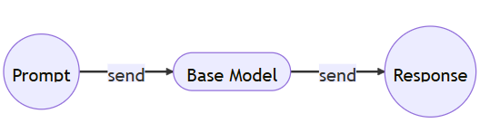
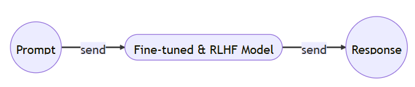
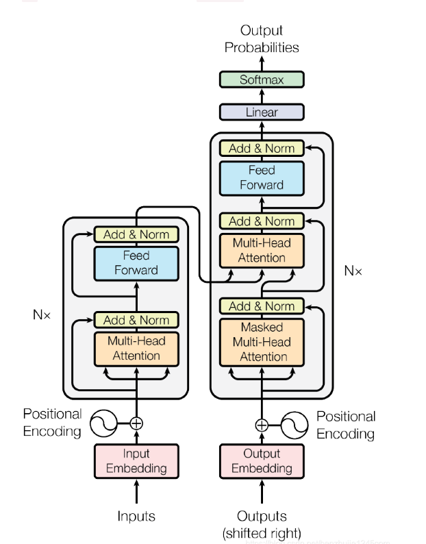
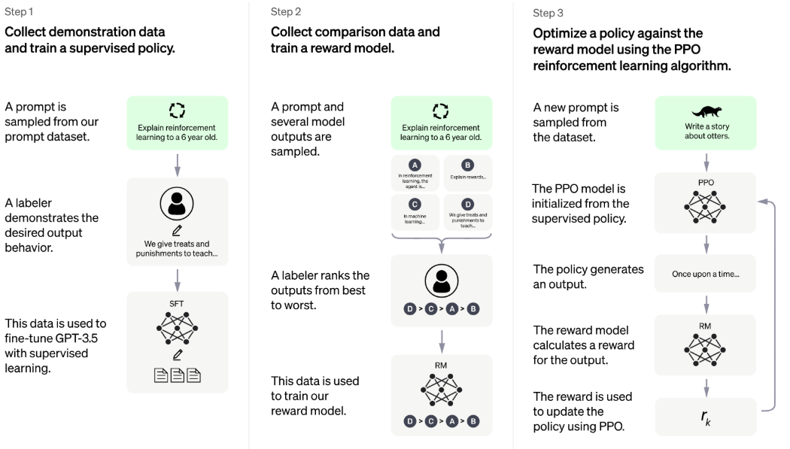

## HOW LLM WORKS
### 1.文档补全模型的工作原理：
    当用户输入：香蕉是...
    模型回复：是一个细长，可食用的水果
### 2. 文档生成器模型工作原理：
    当用户输入提示词：我想买一辆新车
    模型回复：你想买什么样的车

### 在上面两个模型中，第一个模型只是一个文档完成器，它只会用它找到的最有可能成为下一个字符的内容来完成提示。这是我们在互联网数据块上训练的模型，它被称为基础模型。
### 第二个模型是文档生成器，它将根据提示问题生成更像人类的响应。这就是 ChatGPT 模型。
### ChatGPT 模型是一种推理模型，可以根据提示问题生成响应。他可能 99% 都是基本模型，但有两个额外的训练步骤：微调步骤和从人类反馈中强化学习步骤。

## Pre-training:BASE MODEL
### LLM训练的创新之处是引入了Transformer模型，使得模型可以从大量数据中学习，保留输入不同部分之间的关键上下文关系，用于训练基础模型的Transformer架构图下所示
### 接下来需要了解的架构名词与底层逻辑有
    -tokenization,
    -Embedding,
    -Position Encoding,
    -feed-forward,
    -normalization,
    -softmax,
    -linear ,
    -transformation,
    -multi-head attention
## Fine-tuning:TRAIN THE ASSISTANT
### 微调想法非常简单，让人工标记员来创建大量对话对，然后向模型提供对话对，让他从中学习，这个过程就是微调
    人工标记回答：
    问：中国的首都在哪里？
    答：中国的首都是北京。
    人工标记的问答
    问：总结一下电影《泰坦尼克号》的情节。
    答：电影《泰坦尼克号》是关于一艘沉没在海洋中的船的故事。
### 在如此的微调训练之后，相应上下文相应的概率会变高，并且成为用户提示的相应，通过各种对话风格的训练模型，增加了对提示的提供相关且上下文适当的可能性，在这一步之后，我们可以说获得了一个assistant model
### 从预训练基础模型到微调辅助模型的一些关键步骤：
#### Stage1：Pretraining
    1.下载10TB文本文件
    2.需要大量GPU
    3.将数据压缩整合到神经网络中
    4.获得一个基座模型base model
#### Stage2:Finetuning
    1.写一些标签指令
    2.找人工来收集100K高质量问答模型
    3.利用问答模型进行微调
    4.获得一个助手模型assistant model
    5.进行大量评估，部署，监控，收集错误行为，重新进行第一步
## RLHF:Reinforcement Learning from Human Feedback
### 模型是如何通过人类的反应来自己进行微调的
## Prompt Engineering
### 即使进行了微调和强化学习，模型仍然需要一些帮助才能获取所需的相应，这就是提示工程，它使得我们可以通过精心设计的提示和问题，来从模型中获取所需的响应，甚至有时候不需要微调
### 举个例子
    prompt：the sky is
    output: blue
### 通过提示工程的改进
    prompt: Complete the sentence:
            The sky is
    output: blue during the day and dark at night.
### 另外一个例子
    prompt:When I was 6 my sister was half my age. Now I’m 70 how old is my sister?
    output:35
### 无需微调和强化学习，我们在提示中添加更多的示例指令来获取答案
    prompt:A: There are 4 days from monday to thursday. 5 computers were added each day. That means in total 4 * 5 = 20 computers were added. There were 9 computers in the beginning, so now there are 9 + 20 = 29 computers.
    The answer is 29.
    Q: Michael had 58 golf balls. On tuesday, he lost 23 golf balls. On wednesday, he lost 2 more. How many golf balls did he have at the end of wednesday?
    A: Michael initially had 58 balls. He lost 23 on Tuesday, so after that he has 58 - 23 = 35 balls. On Wednesday he lost 2 more so now he has 35 - 2 = 33 balls. The answer is 33.
    Q: Olivia has $23. She bought five bagels for $3 each. How much money does she have left?
    A: She bought 5 bagels for $3 each. This means she spent $15. She has $8 left.
    Q: When I was 6 my sister was half my age. Now I’m 70 how old is my sister?
    A:
    output:When I was 6 my sister was half my age, so she was 3. Now I am 70, so she is 70 - 3 = 67. The answer is 67.
### 我们只需在提示中添加一些示例作为逻辑解释，然后再次提出相同的问题。模型现在可以理解问题并正确回答。