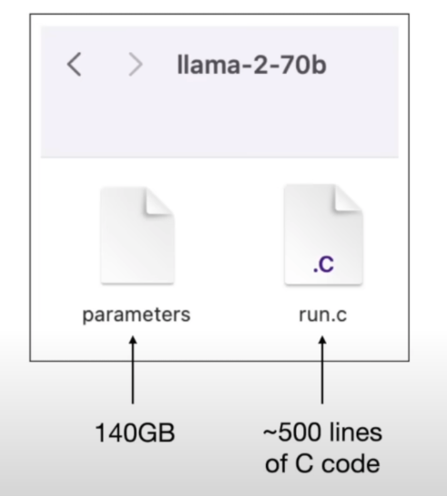

## 什么是大语言模型以及具象化表现
### 1. LLM模型本质上是一种参数数量庞大的神经网络。简而言之，参数越多，模型性能越优。因此我们常听到的模型规模，即指参数数量。例如GPT-3拥有1750亿个参数，而GPT-4的参数数量可能超过1万亿。

### 2.下图中，参数文件是Meta的Llama-2-70b模型，其大小为140GB，包含700亿个参数（以数字形式存储）。run.c文件是推理程序，用于查询该模型。

## 模型推理
### 1. 模型经过训练并且就绪后，用户使用查询模型，问题的文本会传递到140GB文件中并且进行逐个字符处理，然后返回**最相关**的文本作为结果输出。

### 2. 举个例子，模型中，“我爱玩LOL”是一个很常见的句子，而“我爱玩瓦罗兰特”也是一个很常见的句子，但是“我爱玩LOL”出现的概率为0.5，“我爱玩瓦罗兰特”出现的概率只有0.2，故当问题文本为我爱玩...时，就会返回最相关的也就是LOL，这些概率集保存在parameters的模型文件中，其中0.2,0.5这样的概率也被叫做Weights(权重)。

### 3. 总的来说，LLM就是一个概率数据库，为任何给定字符及其相关上下文字符分配概率分布