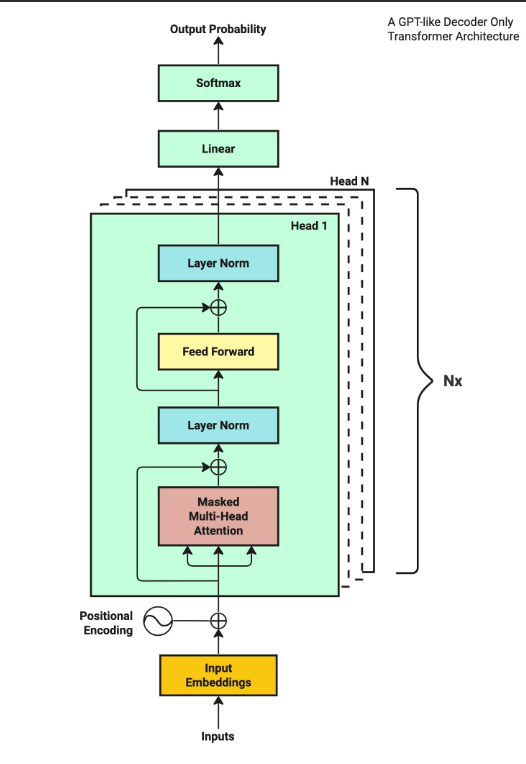
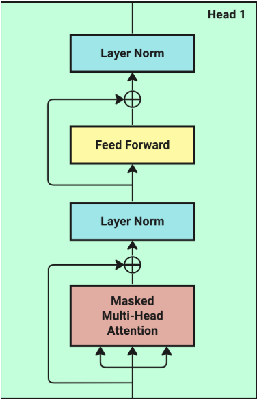
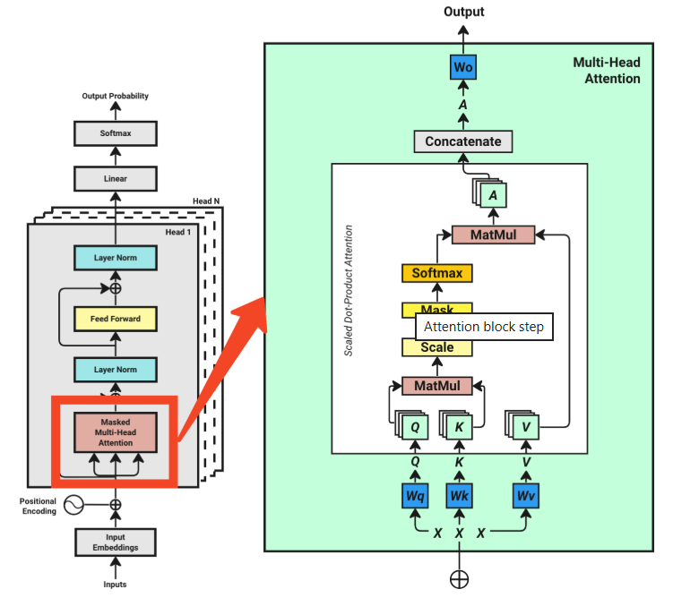
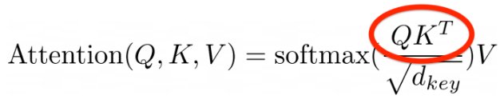
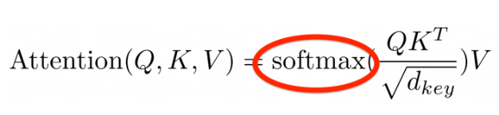
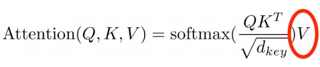

## Transformer Architecture
### 高注意力机制
### Transformer 模型分为两部分：
    Encoder：用于提取信息，适合分类、回归等任务。
    Decoder：用于生成文本，如 GPT 系列模型仅使用 Decoder 部分。
## 解码器架构图
### Stage1，Tokenization:（对应图中Inputs）
#### Token化是模型的第一步，是将输入句子转化为数字表示形式，将文本划分为较小单元，可以是单词，子单词，句子等。
    Chapter 1: Building Rapport and Capturing
    可以分割为：Chapter, , ,1  :  Building   Rap  port   and   Capturing
    将其Token化为十个数字：[26072, 220, 16, 25, 17283, 23097, 403, 220, 323, 220, 17013, 220, 1711]
#### 有很多方法可以将字符标记为整数，常用的之一是tiktoken库
### Stage2，Word Embeddings:（对应图中Input Embeddings）
#### 什么是：是将离散的文本（如词或子词的编号）转换为连续的向量表示的过程。它的核心目的是让模型能够处理和理解语言的语义信息。其中，每一行代表字符，每一列代表一个维度，维度可以理解为这样的字符在不同语境下的文本含义
#### 为什么：Transformer模型不能直接处理文本或整数编号，它只能处理向量。因此，必须将每个 token（词或子词）转换为一个向量，才能输入到模型中。
#### 以下是一个4*16矩阵，16代表了有16个Token，4代表4个批次
    Input Sequence Batch:
        0     1      2      3     4      5      6      7      8      9      10     11     12     13     14     15
    0    627  1383  88861    279  1989    315  25607  16940  65931    323  32097     11    584  26458  13520    449
    1  15749   311   9615   3619   872   6444      6   3966     11  10742     11    323  32097     13   3296  22815
    2  13189   315   1701   5557   304   6763    374  88861   7528  10758   7526     13   4314   7526   2997   2613
    3    323  6376   2867  26470  1603  16661    264  49148    627     18     13  81745  48023  75311   7246  66044
    [4 rows x 16 columns]
#### 以下是一个16*64的矩阵，16仍然代表16个Token，也就是句子，64代表64个维度，也就是不同语境下句子的向量
    Input Embedding:
          0         1         2         3         4         5         6         7         8         9   ...        54        55        56        57        58        59        60        61        62        63
    0   1.051807 -0.704369 -0.913199 -1.151564  0.582201 -0.898582  0.984299 -0.075260 -0.004821 -0.743642  ...  1.151378  0.119595  0.601200 -0.940352  0.289960  0.579749  0.428623  0.263096 -0.773865 -0.734220
    1  -0.293959 -1.278850 -0.050731  0.862562  0.200148 -1.732625  0.374076 -1.128507  0.281203 -1.073113  ... -0.062417 -0.440599  0.800283  0.783043  1.602350 -0.676059 -0.246531  1.005652 -1.018667  0.604092
    2  -0.292196  0.109248 -0.131576 -0.700536  0.326451 -1.885801 -0.150834  0.348330 -0.777281  0.986769  ...  0.382480  1.315575 -0.144037  1.280103  1.112829  0.438884 -0.275823 -2.226698  0.108984  0.701881
    3   0.427942  0.878749 -0.176951  0.548772  0.226408 -0.070323 -1.865235  1.473364  1.032885  0.696173  ...  1.270187  1.028823 -0.872329 -0.147387 -0.083287  0.142618 -0.375903 -0.101887  0.989520 -0.062560
    4  -1.064934 -0.131570  0.514266 -0.759037  0.294044  0.957125  0.976445 -1.477583 -1.376966 -1.171344  ...  0.231112  1.278687  0.254688  0.516287  0.621753  0.219179  1.345463 -0.927867  0.510172  0.656851
    5   2.514588 -1.001251  0.391298 -0.845712  0.046932 -0.036732  1.396451  0.934358 -0.876228 -0.024440  ...  0.089804  0.646096 -0.206935  0.187104 -1.288239 -1.068143  0.696718 -0.373597 -0.334495 -0.462218
    6   0.498423 -0.349237 -1.061968 -0.093099  1.374657 -0.512061 -1.238927 -1.342982 -1.611635  2.071445  ...  0.025505  0.638072  0.104059 -0.600942 -0.367796 -0.472189  0.843934  0.706170 -1.676522 -0.266379
    7   1.684027 -0.651413 -0.768050  0.599159 -0.381595  0.928799  2.188572  1.579998 -0.122685 -1.026440  ... -0.313672  1.276962 -1.142109 -0.145139  1.207923 -0.058557 -0.352806  1.506868 -2.296642  1.378678
    8  -0.041210 -0.834533 -1.243622 -0.675754 -1.776586  0.038765 -2.713090  2.423366 -1.711815  0.621387  ... -1.063758  1.525688 -1.762023  0.161098  0.026806  0.462347  0.732975  0.479750  0.942445 -1.050575
    9   0.708754  1.058510  0.297560  0.210548  0.460551  1.016141  2.554897  0.254032  0.935956 -0.250423  ... -0.552835  0.084124  0.437348  0.596228  0.512168  0.289721 -0.028321 -0.932675 -0.411235  1.035754
    10 -0.584553  1.395676  0.727354  0.641352  0.693481 -2.113973 -0.786199 -0.327758  1.278788 -0.156118  ...  1.204587 -0.131655 -0.595295 -0.433438 -0.863684  3.272247  0.101591  0.619058 -0.982174 -1.174125
    11 -0.753828  0.098016 -0.945322  0.708373 -1.493744  0.394732  0.075629 -0.049392 -1.005564  0.356353  ...  2.452891 -0.233571  0.398788 -1.597272 -1.919085 -0.405561 -0.266644  1.237022  1.079494 -2.292414
    12 -0.611864  0.006810  1.989711 -0.446170 -0.670108  0.045619 -0.092834  1.226774 -1.407549 -0.096695  ...  1.181310 -0.407162 -0.086341 -0.530628  0.042921  1.369478  0.823999 -0.312957  0.591755  0.516314
    13 -0.584553  1.395676  0.727354  0.641352  0.693481 -2.113973 -0.786199 -0.327758  1.278788 -0.156118  ...  1.204587 -0.131655 -0.595295 -0.433438 -0.863684  3.272247  0.101591  0.619058 -0.982174 -1.174125
    14 -1.174090  0.096075 -0.749195  0.395859 -0.622460 -1.291126  0.094431  0.680156 -0.480742  0.709318  ...  0.786663  0.237733  1.513797  0.296696  0.069533 -0.236719  1.098030 -0.442940 -0.583177  1.151497
    15  0.401740 -0.529587  3.016675 -1.134723 -0.256546 -0.219896  0.637936  2.000511 -0.418684 -0.242720  ... -0.442287 -1.519394 -1.007496 -0.517480  0.307449 -0.316039 -0.880636 -1.424680 -1.901644  1.968463
    [16 rows x 64 columns]
### Stage3，Positional Encoding:（对应图中的Positional Encoding）
#### Transformer 的核心机制是 self-attention，它在处理输入时是并行的，不依赖于元素之间的顺序。因此，如果没有额外的位置信息，模型就无法区分
#### 在 Transformer 模型中，Positional Encoding（位置编码）的作用是为模型提供序列中各个元素的位置信息。因为 Transformer 本身不具备处理序列顺序的能力（不像 RNN 或 CNN 那样有天然的顺序结构），所以必须通过位置编码显式地引入位置信息。
#### Transformer提供固定或可学习的向量，将每个位置映射为一个独特的编码，然后加到词向量中，实际上位置编码只创建一次，并为每个输入序列重复使用
    PE(pos, 2i) = sin(pos / 10000^(2i/d_model))
    PE(pos, 2i+1) = cos(pos / 10000^(2i/d_model))
    假设我们有两个词分别在位置 10 和位置 20，它们的编码在不同维度上会呈现不同的正余弦值。模型可以通过这些差异来判断它们之间的距离和顺序。
## 至此，输入编码和位置编码已经解决，剩下的就是Transformer核心，Transformer块。
    Transformer 块是由三层组成的堆栈：一个mask的多头注意力机制、两个归一化层和一个前馈网络。
    mask多头注意力是一组自我注意力，每个注意力称为一个头。
### Stage4.0，多头注意力机制概述 
#### 它让模型在多个“注意力子空间”中并行地学习信息，从而更全面地理解输入序列的语义结构。可以从多个角度理解句子结构，捕捉不同层次的语义信息，增强模型的表达能力
#### 它的核心思想是：将注意力机制复制多份，每份称为一个“头”（head），每个头在不同的子空间中独立学习，然后将它们的结果拼接起来。
    举个例子：假设我们有一句话：“The cat sat on the mat”，不同的注意力头可能关注：
    第一个头：关注“cat”和“sat”的关系（主谓）
    第二个头：关注“on”和“mat”的关系（介宾）
    第三个头：关注“the”的修饰作用
    每个头都在不同的语义维度上“观察”句子，从而让模型更全面地理解语言。
### Stage4.1，准备Q,K,V
#### 计算注意力机制的第一步是获取 Q（Query）、K（Key）和 V（Value）矩阵。这三个矩阵将在注意力层中用于计算注意力概率（权重）。它们是通过将前一步得到的位置嵌入矩阵（记为 X）分别乘以三个不同的线性层权重矩阵 Wq、Wk 和 Wv 得到的（这些权重初始值是随机的，并且是可学习的）。每个线性层的输出随后会被拆分成多个头（num_heads），这里我们选择 4 个头。
#### Wq、Wk、Wv 是三个维度为 (d_model, d_model) = [64, 64] 的矩阵。它们的值最初是随机分配的。在神经网络中，这些被称为线性层或可训练参数。可训练参数是模型在训练过程中会学习并自动更新的值。
#### 为了获得 Q、K、V，我们将输入嵌入矩阵 X 分别与 Wq、Wk、Wv 进行矩阵乘法：
    Q = X × Wq
    K = X × Wk
    V = X × Wv
#### 矩阵乘法的逻辑如下：
#### X 的形状为 (batch_size, context_length, d_model) = [4, 16, 64]，我们将其拆分为 4 个子矩阵，每个形状为 [16, 64]。Wq、Wk、Wv 的形状为 [64, 64]。我们可以对每个子矩阵与 Wq、Wk、Wv 进行乘法运算。根据线性代数的规则，两个矩阵相乘的前提是第一个矩阵的列数等于第二个矩阵的行数。在我们的例子中，X 的列数是 64，Wq、Wk、Wv 的行数也是 64，因此可以进行乘法。乘法结果是 4 个形状为 [16, 64] 的子矩阵，合并后可以表示为形状为 [4, 16, 64] 的矩阵。现在我们得到了 Q、K、V，它们的形状都是 [4, 16, 64]。接下来我们需要将它们拆分成多个头，这也是 Transformer 架构被称为“多头注意力”的原因。
#### 拆分头的意思是将原始的 64 维度分成多个子维度，每个头包含一定数量的维度。每个头可以学习输入中的某些模式或语义。假设我们设置 num_heads 为 4，这意味着我们将 Q、K、V 的形状从 [4, 16, 64] 拆分为多个子矩阵。具体拆分是通过将最后一个维度 64 重塑为 4 个子维度，每个为 16。因此，Q、K、V 的形状从 [4, 16, 64] 转换为 [4, 16, 4, 16]。最后两个维度表示头的数量和每个头的维度。也就是说，从：
    [batch_size, context_length, d_model] 
#### 变成了：
    [batch_size, context_length, num_heads, head_size]
### Stage4.2，计算Q,K注意力
#### 根据Transformer架构，首先对Q和K进行计算
#### 暂时忽略 batch_size，只保留最后三个维度，此时 Q = K = V 的形状为 [context_length, num_heads, head_size] = [16, 4, 16]。我们需要对前两个维度进行一次转置，使得它们的形状变为 Q = K = V = [num_heads, context_length, head_size] = [4, 16, 16]。这样做是为了方便在最后两个维度上进行矩阵乘法。Q × Kᵀ 的形状为 [4, 16, 16] × [4, 16, 16]，结果仍为 [4, 16, 16]。
#### 为什么要这样做？这次转置的目的是为了在不同的上下文之间进行矩阵乘法。最后两个维度 [16, 16] 。这个矩阵中，每一行和每一列都代表我们示例句子中的一个 token（词）。矩阵乘法的结果就是每个词与其他所有词之间的相似度评分。数值越高，表示它们越相似。
    [ 0.2712,  0.5608, -0.4975,  ..., -0.4172, -0.2944,  0.1899],
    [-0.0456,  0.3352, -0.2611,  ...,  0.0419,  1.0149,  0.2020],
    [-0.0627,  0.1498, -0.3736,  ..., -0.3537,  0.6299,  0.3374],
      ...,      ...,       ...,  ...,    ...,     ...,      ...,
    [-0.4166, -0.3364, -0.0458,  ..., -0.2498, -0.1401, -0.0726],
    [ 0.4109,  1.3533, -0.9120,  ...,  0.7061, -0.0945,  0.2296],
    [-0.0602,  0.2428, -0.3014,  ..., -0.0209, -0.6606, -0.3170]
#### 目前这些相似度评分没有实际意义，因为它们是由随机初始化的参数计算出来的。但在训练完成后，这些评分将变得有意义。现在我们将 batch_size 维度重新加回 Q×K 的注意力评分中，最终结果的形状为 [batch_size, num_heads, context_length, head_size]，即 [4, 4, 16, 16]。
### Stage4.3，Scale（缩放）
#### 缩放这一步其实很简单，我们只需要将 Q×Kᵀ 的注意力得分除以 K 的维度的平方根。在这里，K 的维度等于 Q 的维度，也就是 d_model 除以 num_heads：64 ÷ 4 = 16。然后我们取 16 的平方根，得到 4。接着将 Q×Kᵀ 的注意力得分除以 4。这样做的原因是为了防止 Q×Kᵀ 的得分值过大，这可能会导致 softmax 函数饱和，从而使梯度消失，影响模型的训练效果。
### Stage4.4，Mask（掩码）
#### 在仅使用解码器的 Transformer 模型中，掩码自注意力（masked self-attention）本质上起到了类似序列填充（padding）的作用。解码器只能查看当前字符之前的内容，不能查看未来的字符。因此，未来的字符会被“屏蔽”（masked），在计算注意力权重时不予考虑。在多头注意力层中使用掩码的目的，是为了防止解码器“窥视未来”。在我们的示例句子中，解码器只能看到当前词以及它之前的所有词。
### Stage4.5，Softmax
#### Softmax 步骤会将一组数值转换成一种特殊的列表，其中所有数值的总和为 1。它会放大较大的数值，压缩较小的数值，从而形成更明确的选择。简而言之，softmax 函数的作用是将线性层的输出转换为概率分布。
#### 在现代深度学习框架（如 PyTorch）中，softmax 是一个内置函数，使用起来非常简单：
    torch.softmax(attention_score, dim=-1)
#### 这行代码会对我们在前一步计算出的所有注意力得分应用 softmax，最终得到一个介于 0 到 1 之间的概率分布。
#### 我们来看一下某个注意力头在应用 softmax 后的得分示例：
    [1.0000, 0.0000, 0.0000,  ..., 0.0000, 0.0000, 0.0000],
    [0.4059, 0.5941, 0.0000,  ..., 0.0000, 0.0000, 0.0000],
    [0.3368, 0.4165, 0.2468,  ..., 0.0000, 0.0000, 0.0000],
    ...,
    [0.0463, 0.0501, 0.0670,  ..., 0.0547, 0.0000, 0.0000],
    [0.0769, 0.1974, 0.0205,  ..., 0.1034, 0.0464, 0.0000],
    [0.0684, 0.0926, 0.0537,  ..., 0.0711, 0.0375, 0.0529]
#### 这些概率值现在都是正数，并且每一行的总和都是 1。
### Stage4.6，计算V注意力
#### 我们的 V 矩阵也已经被拆分成多个注意力头，其形状为 (batch_size, num_heads, context_length, head_size) = [4, 4, 16, 16]。而前一步 softmax 的输出形状也是 (batch_size, num_heads, context_length, head_size) = [4, 4, 16, 16]。我们需要对这两个矩阵的最后两个维度进行矩阵乘法运算：
    softmax_output × V = [4, 4, 16, 16] × [4, 4, 16, 16] = [4, 4, 16, 16]
    运算结果的形状为 [batch_size, num_heads, context_length, head_size] = [4, 4, 16, 16]。
#### 我们将这个结果称为 A。
### Stage4.7，拼接和输出（Concatenate and Output）
#### 多头注意力机制的最后一步是将所有注意力头的输出拼接在一起，并通过一个线性层进行变换。拼接的目的是将所有注意力头中学到的信息整合在一起。因此，我们需要将矩阵 A 的形状从 [batch_size, num_heads, context_length, head_size] = [4, 4, 16, 16] 重塑为 [batch_size, context_length, num_heads, head_size] = [4, 16, 4, 16]。这样做的原因是为了将最后两个维度合并，方便后续通过矩阵乘法将其恢复为原始维度：
    num_heads × head_size = d_model = 64
#### 这可以通过 PyTorch 的内置函数轻松实现：
    A = A.transpose(1, 2)  # [4, 16, 4, 16]，即 [batch_size, context_length, num_heads, head_size]
#### 接下来，我们需要将最后两个维度 [num_heads, head_size] = [4, 16] 合并为 [d_model] = [64]：
    A = A.reshape(batch_size, -1, d_model)  # [4, 16, 64]，即 [batch_size, context_length, d_model]
#### 可以看到，经过一系列计算后，我们的结果矩阵 A 又回到了与输入嵌入矩阵 X 相同的形状：[batch_size, context_length, d_model] = [4, 16, 64]。由于这个输出结果将作为下一层的输入，因此保持输入输出形状一致是非常重要的。
#### 但在传递给下一层之前，我们还需要对它进行一次线性变换。这是通过将拼接后的矩阵 A 与 Wo 进行矩阵乘法来完成的。这个 Wo 是一个形状为 [d_model, d_model] 的随机初始化矩阵，并将在训练过程中不断更新。
    Output = A × Wo = [4, 16, 64] × [64, 64] = [4, 16, 64]
#### 线性层的输出就是单头注意力的最终输出，记为 output。
### Stage5，残差连接与层归一化（Residual Connection and Layer Normalization）
#### 残差连接（有时也称为跳跃连接）是一种让原始输入 X 跳过一个或多个网络层的连接方式。这实际上就是将原始输入 X 与多头注意力层的输出进行相加。由于它们的形状相同，相加操作非常直接：
    output = output + X
#### 在残差连接之后，接下来就是层归一化（LayerNorm）。LayerNorm 是一种对每一层的输出进行归一化的技术。它的做法是：从每个输出中减去均值，然后除以标准差。这种技术的目的是防止某一层的输出值过大或过小，从而避免网络变得不稳定。在 PyTorch 中，这也只需要一行代码就能实现：
    nn.LayerNorm
### Stage6，前馈神经网络（Feed-Forward Network）
#### 一旦我们得到了归一化后的注意力权重（概率分布），它将被送入一个逐位置的前馈神经网络进行处理。这个前馈网络（FFN）由两个线性层组成，中间夹着一个 ReLU 激活函数。我们来看一下 Python 代码是如何实现的：
    # 定义前馈神经网络
    output = nn.Linear(d_model, d_model * 4)(output)
    output = nn.ReLU()(output)
    output = nn.Linear(d_model * 4, d_model)(output)
#### 以下是 ChatGPT 对这段代码的解释：
    output = nn.Linear(d_model, d_model * 4)(output)：这一步对输入数据进行线性变换，即𝑦=𝑥𝐴𝑇+𝑏。输入和输出的维度分别是 d_model 和 d_model × 4。这一步的作用是提升输入数据的维度。
    output = nn.ReLU()(output)：这一步对数据应用 ReLU 激活函数，它是逐元素处理的。ReLU 引入了非线性，使模型能够学习更复杂的模式。
    output = nn.Linear(d_model * 4, d_model)(output)：这一步再次进行线性变换，将维度从 d_model × 4 压缩回 d_model。这种“先扩展再压缩”的结构在神经网络中非常常见。
#### 这个前馈网络就是一个标准的神经网络模块，它的输入和输出都是注意力得分。它的作用是：
    将注意力得分的维度从 64 扩展到 256，使信息更加细化，便于模型学习更复杂的知识结构；
    然后再将维度压缩回 64，使其适合后续的计算流程。
### Stage7，重复Stage4-6
### Stage8，输出概率（Output Probabilities）
#### 在推理阶段，我们希望从模型中得到下一个预测的 token（词），但目前我们得到的其实是整个词汇表中所有 token 的概率分布。还记得我们之前的示例中词汇表大小是 3,771 吗？因此，为了从中选出概率最高的 token，我们需要构建一个矩阵，其大小为模型维度 d_model = 64 与词汇表大小 vocab_size = 3,771 的组合。这个步骤在训练和推理阶段是一样的。
    # 应用最终线性层以获得 logits
    logits = nn.Linear(d_model, vocab_size)(output)
#### 我们将通过这个线性层得到的输出称为 logits。logits 的形状为 [batch_size, context_length, vocab_size] = [4, 16, 3771]。接着，我们使用 softmax 函数将 logits 转换为概率分布：
    logits = torch.softmax(logits, dim=-1)
#### 在训练阶段，我们通常不需要显式地应用 softmax 函数，而是使用 nn.CrossEntropy 函数，因为它内部已经包含了 softmax 的行为。那么我们如何理解这个形状为 [4, 16, 3771] 的 logits 呢？其实经过所有计算后，它的含义非常简单： 我们有 4 个批次（batch），每个批次包含输入序列中的 16 个词。对于每个词，模型都会给出它在整个词汇表中与其他词的概率分布。如果模型正在训练中，我们更新这些概率参数，如果模型处于推理阶段，我们只需选择一个概率最高的参数。然后一切都有意义了。