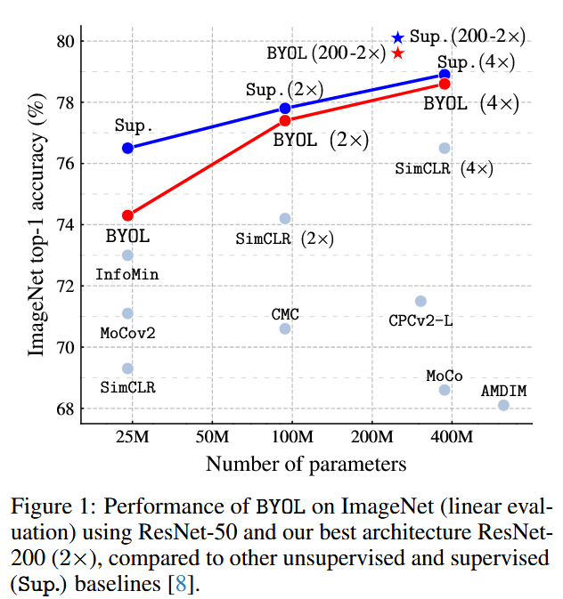
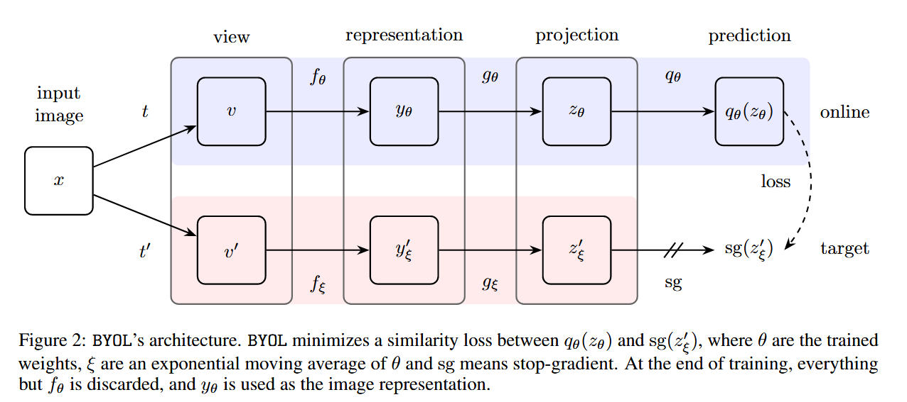
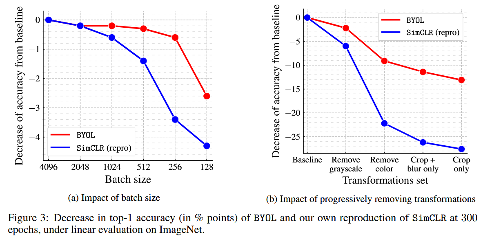
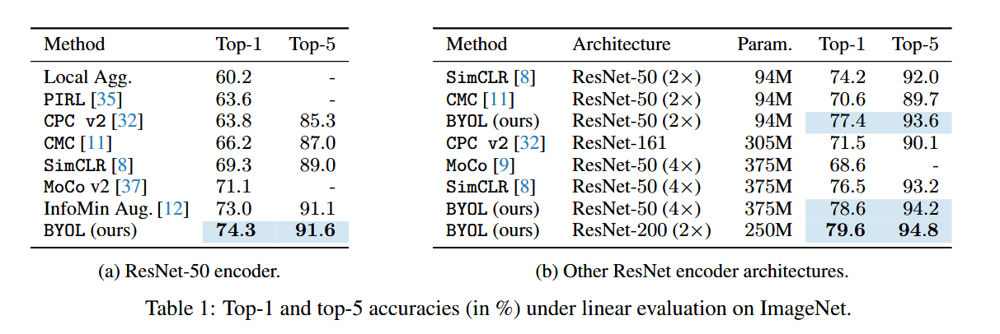
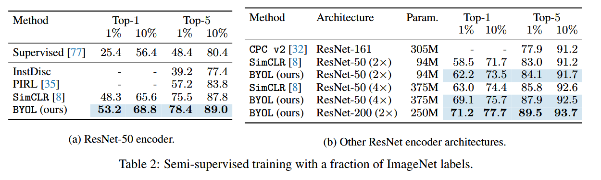
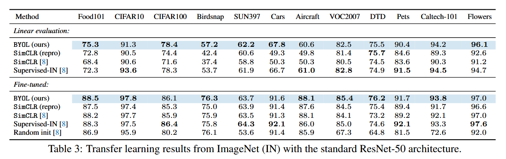
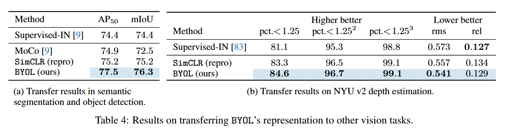
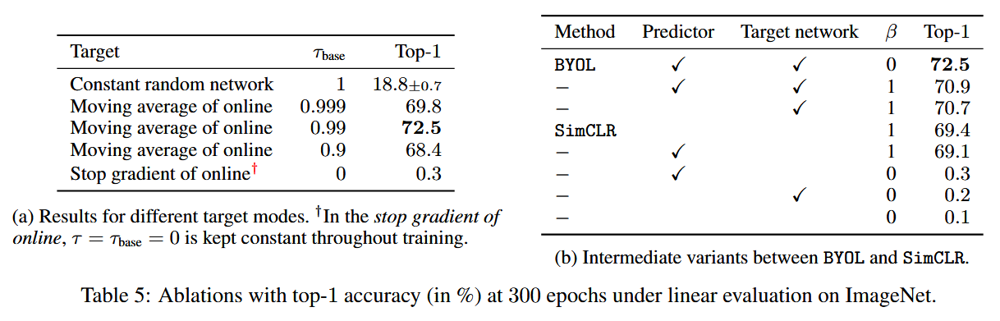

---

## 图像部分

### 图1：ImageNet上的性能对比图（线性评估）

**内容描述**：
- 横轴：模型参数数量（从25M到400M）
- 纵轴：ImageNet top-1 准确率（从68%到80%）
- 展示了 BYOL 在不同架构下（ResNet-50、ResNet-200、2x、4x）与其他方法（SimCLR、MoCo、CMC、CPCv2、AMDIM、InfoMin）以及监督学习（Sup.）的性能对比。

**总结说明**：
- BYOL 在所有参数规模下都优于其他自监督方法。
- 在 ResNet-200 (2x) 上达到 79.6%，接近甚至超过监督学习的最强基线。
- 说明 BYOL 的可扩展性强，性能随模型规模提升而显著增强。

---

### 图2：BYOL的网络结构图

**内容描述**：
- 展示了 BYOL 的训练流程：
  - 输入图像 → 两个增强视图 \( v \) 和 \( v' \)
  - Online 网络：编码器 \( f_\theta \)、投影头 \( g_\theta \)、预测器 \( q_\theta \)
  - Target 网络：编码器 \( f_\xi \)、投影头 \( g_\xi \)，但无预测器
  - 计算预测结果与目标投影之间的相似度损失
  - Target 网络参数通过 EMA 更新，图中标注了 stop-gradient

**总结说明**：
- 图像清晰展示了 BYOL 的非对称结构和训练流程。
- 强调了预测器的作用和 EMA 更新机制对稳定训练的重要性。
- 最终只保留编码器 \( f_\theta \) 用于下游任务。

---
## Figure 3：BYOL在不同架构下的训练曲线

**内容描述**：
- 展示了 BYOL 在不同 ResNet 架构（50、101、152、200）下的训练过程中的 top-1 准确率随 epoch 的变化。
- 横轴是训练 epoch，纵轴是 ImageNet 上的 top-1 准确率。
- 曲线显示 BYOL 在训练早期就能快速提升准确率，并在后期趋于稳定。

**总结说明**：
- BYOL 在所有架构下都表现出良好的收敛性。
- 更深的网络（如 ResNet-200）在训练后期达到更高的准确率。
- 说明 BYOL 的训练稳定性强，且能充分利用更大的模型容量。

---

## 表格部分

### 表1：ImageNet线性评估结果（Top-1 和 Top-5 准确率）

**内容描述**：
- 对比了多种自监督方法在 ResNet-50 和其他架构下的表现。
- BYOL 在 ResNet-50 上达到 74.3% top-1，91.6% top-5。
- 在更大模型（ResNet-200 2x）上达到 79.6% top-1，94.8% top-5。

**总结说明**：
- BYOL 在标准和扩展架构下均优于 SimCLR、MoCo、CMC 等方法。
- 在 ResNet-50 (4x) 上达到 78.6%，几乎与监督学习持平。
- 证明 BYOL 的表示质量极高，适用于大规模模型。

---

### 表2：ImageNet半监督训练结果（1% 和 10% 标签）

**内容描述**：
- 展示了在仅使用部分标签时的分类性能。
- BYOL 在 1% 标签下达到 53.2% top-1，78.4% top-5。
- 在 10% 标签下达到 68.8% top-1，89.0% top-5。
- 在更大模型下（ResNet-200 2x）达到 77.7% top-1。

**总结说明**：
- BYOL 在低标签场景下表现优异，远超 SimCLR 和其他方法。
- 说明其表示具有良好的可迁移性和数据效率。
- 在全标签微调时也能达到与监督学习相当的性能。

---

### 表3：迁移学习评估（12个下游分类任务）

**内容描述**：
- 数据集包括 Food101、CIFAR10/100、Birdsnap、SUN397、Cars、Aircraft、VOC2007、DTD、Pets、Caltech-101、Flowers。
- 对比了 BYOL、SimCLR（原始与复现）、Supervised-IN 的线性评估结果。

**总结说明**：
- BYOL 在 12 个任务中有 7 个超过监督学习基线，其他任务也非常接近。
- 在 CIFAR10、Pets、Flowers 等小图像任务上表现尤为突出。
- 说明 BYOL 学到的表示具有强泛化能力，适用于多种视觉领域。

---

## Table 4：不同图像增强策略对 BYOL 和 SimCLR 的影响

**内容描述**：
- 对比了在不同图像增强组合下，BYOL 和 SimCLR 的性能变化。
- 增强策略包括：仅随机裁剪、裁剪+颜色扰动、裁剪+模糊、裁剪+颜色+模糊等。
- 展示了每种策略下的 ImageNet top-1 准确率。

**总结说明**：
- BYOL 对图像增强策略的鲁棒性更强。
- 即使只使用随机裁剪，BYOL 仍能保持较高性能，而 SimCLR 性能显著下降。
- 说明 BYOL 不依赖复杂增强策略，训练更灵活。

---

## Table 5：消融实验结果

**内容描述**：
- 包含多个子表（如 Table 5a、5b），分别测试不同组件对性能的影响：
  - 是否使用预测器
  - 是否使用 EMA target 网络
  - 是否使用对称损失
  - 是否使用归一化
- 每项实验都报告了 ImageNet 上的 top-1 准确率。

**总结说明**：
- 移除预测器或 EMA target 网络都会导致性能显著下降，甚至出现表示坍塌。
- 使用对称损失和归一化能进一步提升性能。
- 说明 BYOL 的设计各组件都至关重要，缺一不可。

---

## 总结归纳

| 图像/表格 | 作用 | 说明 |
|-----------|------|------|
| 图1 | 性能对比 | 展示 BYOL 在不同模型规模下的表现，优于所有自监督方法 |
| 图2 | 方法结构 | 清晰展示 BYOL 的双网络结构与训练流程 |
| 表1 | 线性评估 | BYOL 在 ImageNet 上达到新 SOTA，尤其在大模型下 |
| 表2 | 半监督评估 | BYOL 在低标签场景下表现优异，数据效率高 |
| 表3 | 迁移评估 | BYOL 表示具有强泛化能力，适用于多种视觉任务 |
| 图表 | 内容 | 说明 |
| Figure 3 | 不同架构下的训练曲线 | 展示 BYOL 的收敛速度和稳定性，深层模型表现更优 |
| Table 4 | 图像增强策略对比 | BYOL 对增强策略更鲁棒，训练更灵活 |
| Table 5 | 消融实验 | 验证预测器、EMA、对称损失等组件的重要性 |

---
