---

# 图像详解（共 7 张）

---

### **Figure 1：ViT Attention 显示语义分割能力**
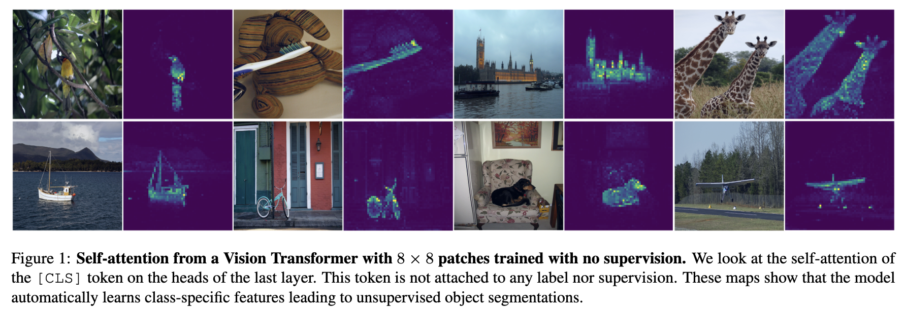

**内容**：展示了 ViT-S/8 模型在无监督训练下，最后一层的 [CLS] token 的 self-attention map。

**解读**：
- 每个 attention head 聚焦于图像中不同区域。
- 模型自动学习出物体边界，形成类似语义分割的结构。
- 这是 ViT 在自监督下的“涌现性质”，监督训练或 CNN 中不明显。

---

### **Figure 2：DINO 框架示意图**
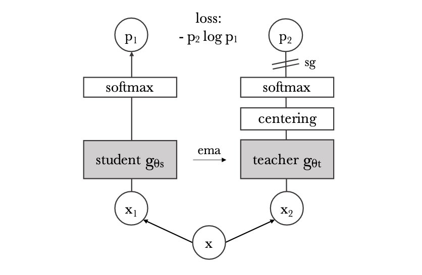

**内容**：展示了 DINO 的训练流程，包括学生网络、教师网络、中心化、温度缩放、EMA 更新等。

**解读**：
- 输入图像生成两个视图 x₁ 和 x₂。
- 学生和教师网络结构相同但参数不同。
- 教师输出经过中心化和 sharpening，学生通过 cross-entropy loss 对齐。
- 教师参数通过 EMA 从学生更新，形成“无标签知识蒸馏”。

---

### **Figure 3：不同 Attention Head 的语义聚焦**
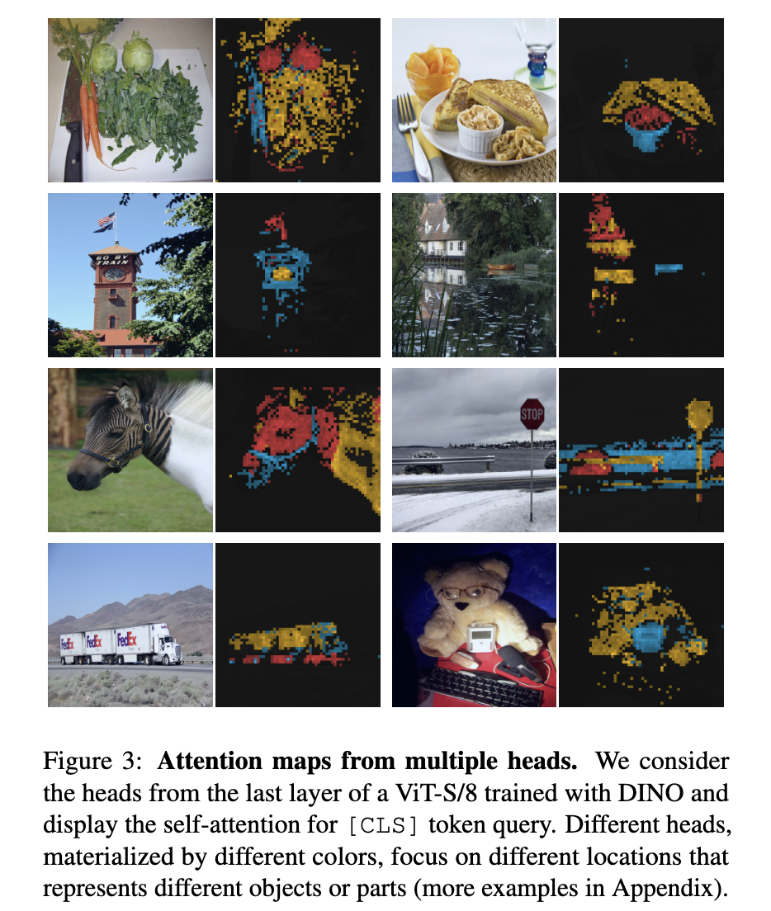

**内容**：展示多个 attention head 的关注区域。

**解读**：
- 不同 head 聚焦于不同语义区域，如背景、主体、边缘。
- 体现 ViT 的多视角结构感知能力。
- 支持论文关于“结构信息在自监督下自然涌现”的论点。

---

### **Figure 4：DINO vs 监督模型的 Attention Mask**
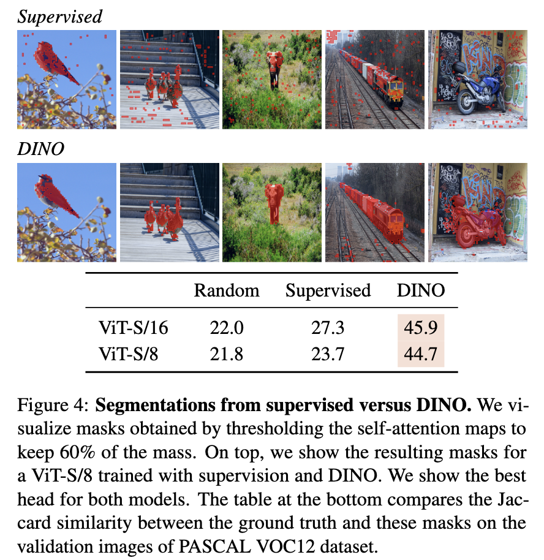

**内容**：比较 DINO 和监督训练模型的 attention mask 与真实语义分割的 Jaccard 相似度。

**解读**：
- DINO 的 attention 更贴近真实物体边界。
- 监督模型的 attention 更分散，缺乏结构性。
- 证明 DINO 能激发 ViT 的语义聚焦能力。

---

### **Figure 5：Patch Size 对性能与吞吐量的影响**
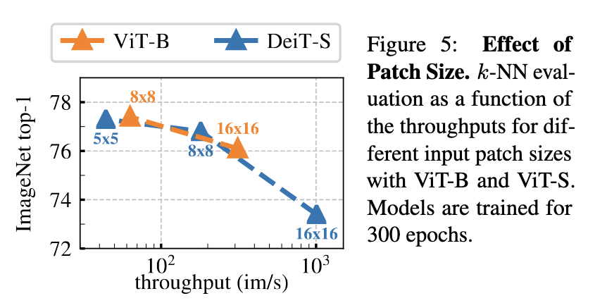

**内容**：展示不同 patch size（如 16×16 vs 8×8）对模型性能和推理速度的影响。

**解读**：
- Patch 越小，token 越多，性能越好但计算成本上升。
- ViT-B/8 在性能上最优，但吞吐量最低。
- 提供模型选择时的资源-精度权衡参考。

---

### **Figure 6：教师 vs 学生性能对比**
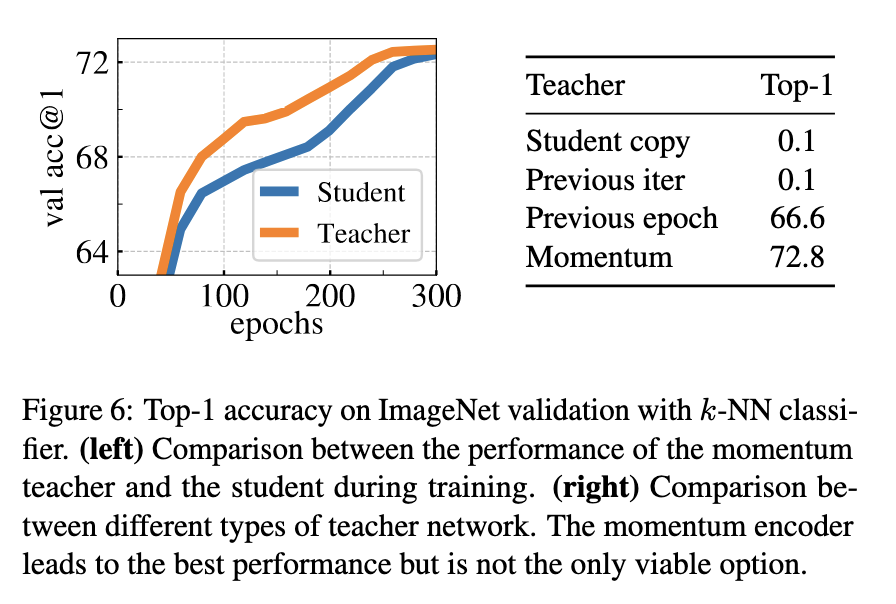

**内容**：展示训练过程中教师网络与学生网络的性能差异。

**解读**：
- 教师网络始终优于学生，说明 EMA 聚合的参数更稳定。
- 支持使用 momentum encoder 的设计选择。
- 类似 Polyak-Ruppert 平均的模型集成效果。

---

### **Figure 7：Collapse 分析：Entropy 与 KL 演化**
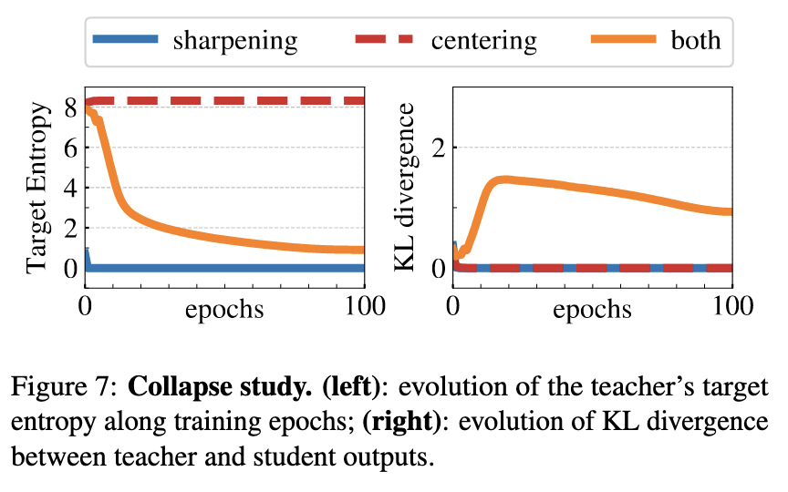

**内容**：分析不同防 collapse 技术（centering、sharpening）对模型输出分布的影响。

**解读**：
- 仅使用 centering 或 sharpening 会导致 collapse。
- 两者结合可稳定训练，避免输出退化为常数或均匀分布。
- 支持 DINO 的设计选择：无对比损失也能稳定训练。

---

# 表格详解（共 13 张）

---

### **Table 1：网络结构配置对比**
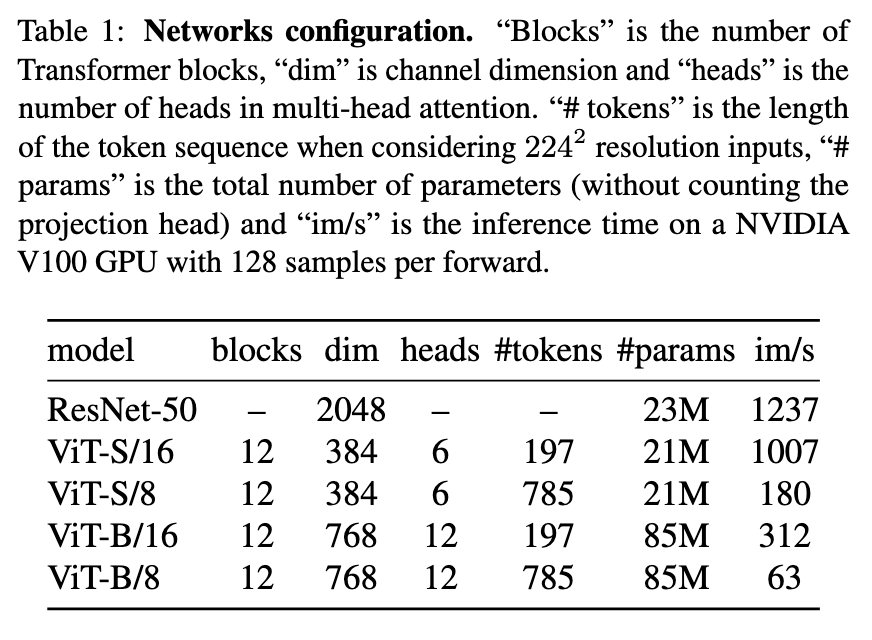

| 模型 | Blocks | Dim | Heads | Tokens | 参数量 | 推理速度 |
|------|--------|-----|--------|--------|--------|----------|

**解读**：
- 比较 ViT 和 ResNet 的结构参数。
- ViT-S 与 RN50 参数量相近，ViT-B 更大但性能更强。
- Patch 越小，token 越多，推理速度下降。

---

### **Table 2：ImageNet 分类性能对比**
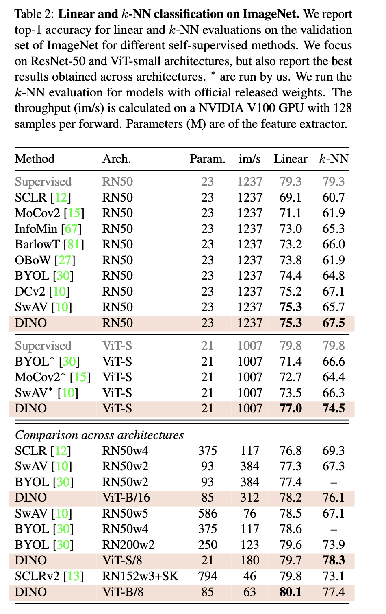

| 方法 | 架构 | Linear Top-1 | k-NN Top-1 |

**解读**：
- DINO 在 ViT 上表现远超其他方法。
- k-NN 准确率接近 Linear Probe，表征质量极高。
- ViT-B/8 性能最佳，验证 DINO 与 ViT 的协同效应。

---

### **Table 3：图像检索性能（Oxford & Paris）**
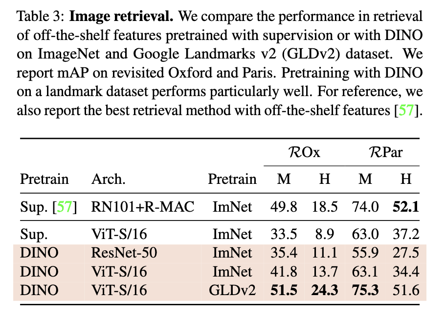

| 预训练 | 架构 | 数据集 | ROX-M | ROX-H | RPar-M | RPar-H |

**解读**：
- DINO 特征优于监督模型，尤其在 landmark 数据集预训练下。
- ViT 特征更适合检索任务，结构性更强。

---

### **Table 4：Copydays 数据集复制检测性能**
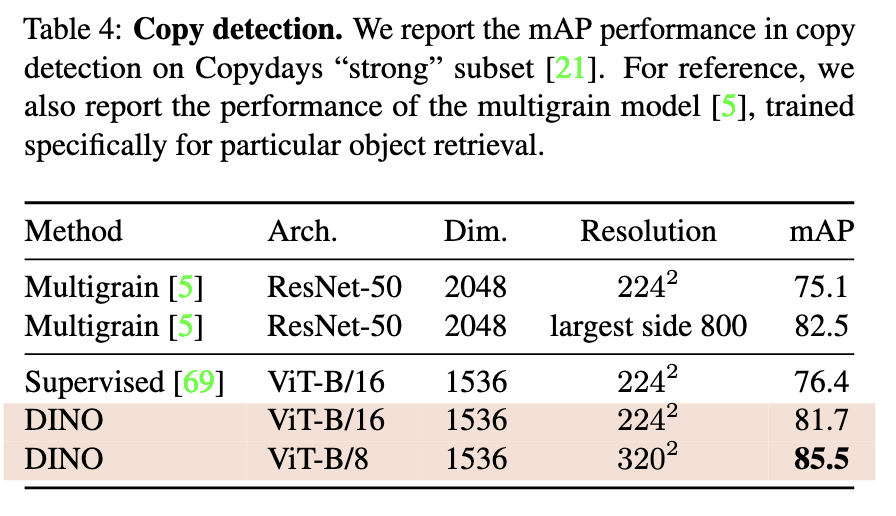

| 方法 | 架构 | 分辨率 | mAP |

**解读**：
- DINO 在 ViT 上适用于细粒度匹配任务。
- 与专门设计的 Multigrain 模型接近，验证通用性。

---

### **Table 5：DAVIS 视频分割性能**
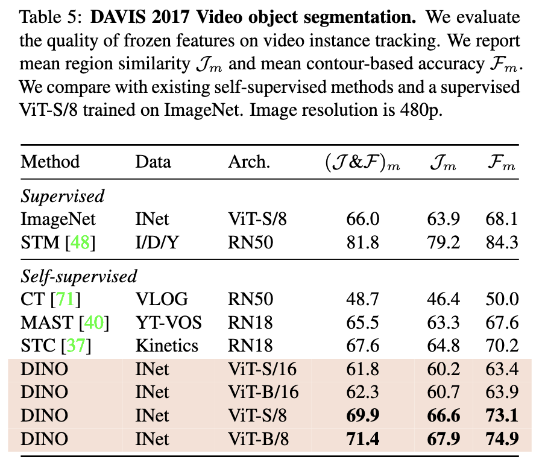

| 方法 | 架构 | mIoU |

**解读**：
- DINO 特征保留空间信息，适用于密集识别任务。
- ViT 的结构感知能力在视频分割中也有优势。

---

### **Table 6：下游任务迁移性能**
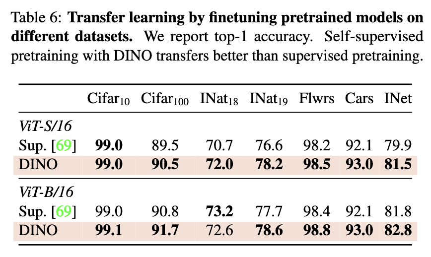

| 数据集 | 方法 | 架构 | 准确率 |

**解读**：
- DINO 预训练的 ViT 在多个数据集上优于监督模型。
- 表征具备良好的迁移性和泛化能力。

---

### **Table 7：DINO 组件消融实验**
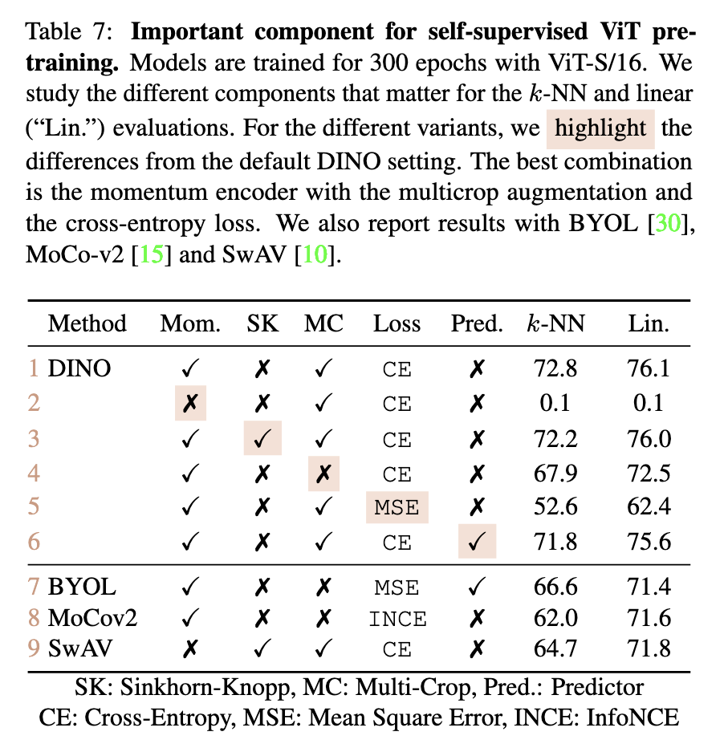

| 组件 | 是否启用 | 性能变化 |

**解读**：
- 验证 momentum encoder、multi-crop、cross-entropy loss 的重要性。
- predictor、BN 等组件影响较小，支持 DINO 的简洁设计。

---

### **Table 8：多视图训练的时间与内存消耗**
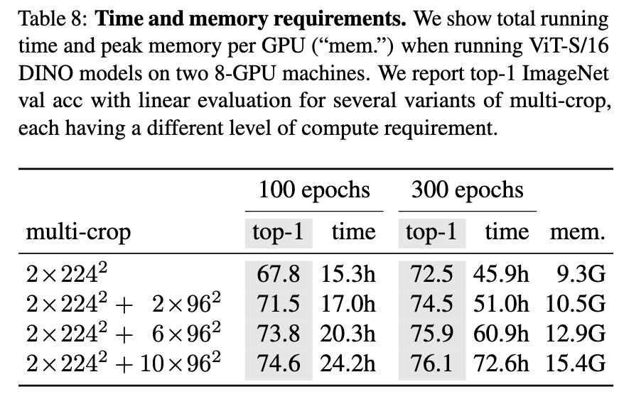

| 视图数 | 内存 | 训练时间 | 准确率 |

**解读**：
- 多 crop 提升性能但增加内存。
- 提供资源与精度间的权衡依据。

---

### **Table 9：Batch size 对性能影响**
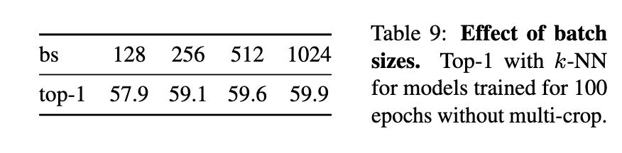

| Batch size | 准确率 |

**解读**：
- 小 batch 也能训练出高质量特征。
- DINO 对 batch size 不敏感，适合资源受限场景。

---

### **Table 10：ViT-S 与 RN50 的评估对比**
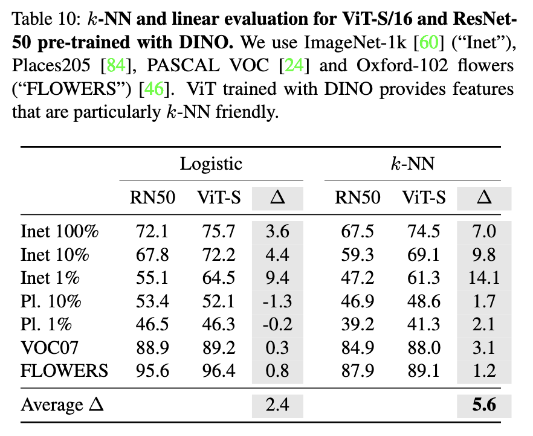

| 方法 | 架构 | Linear | k-NN |

**解读**：
- ViT-S 特征更适合 k-NN，迁移性更强。
- 支持 ViT 在自监督下的结构优势。

---

### **Table 11：不同预训练方式对 ViT-B 的影响**
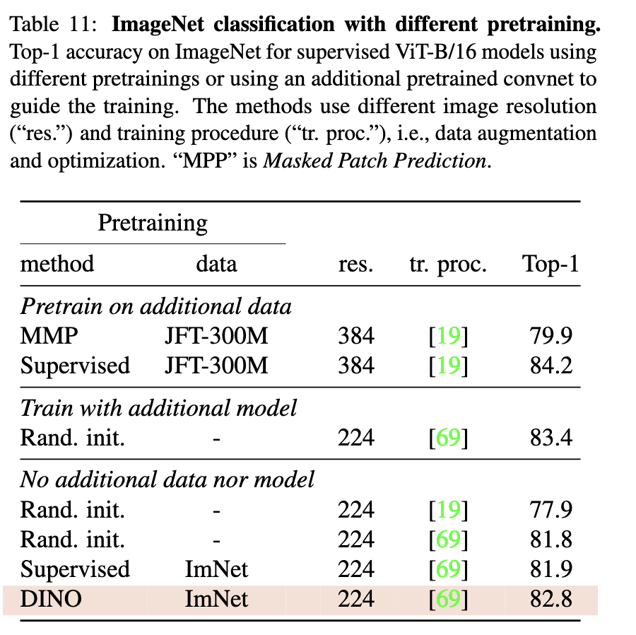

| 预训练方式 | 准确率 |

**解读**：
- DINO 预训练优于随机初始化与监督训练。
- 自监督能激发 ViT 的潜力。

---

### **Table 12：ImageNet 小样本学习性能**
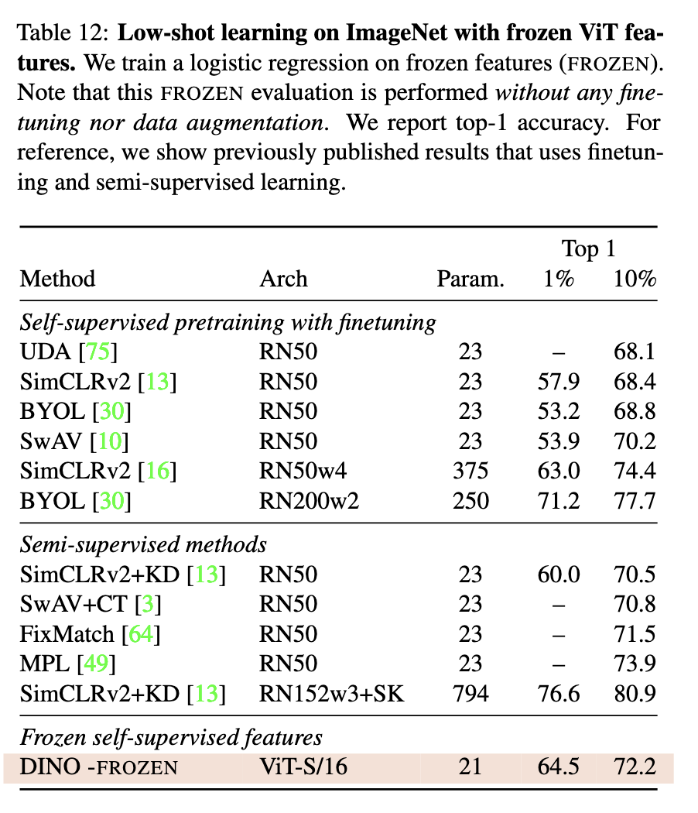

| 标签比例 | 方法 | 准确率 |

**解读**：
- DINO 特征在低标签下表现接近半监督方法。
- 支持自监督在低资源场景的应用价值。

---

### **Table 13：方法对比：DINO vs MoCo vs BYOL vs SwAV**
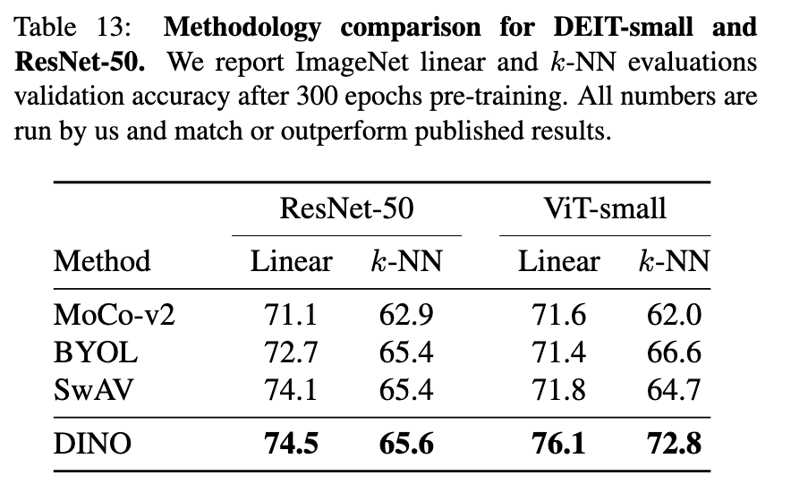

| 方法 | 架构 | Linear | k-NN |

**解读**：
- DINO 在 ViT 上显著优于其他方法，尤其是 k-NN 评估。
- 支持 DINO 成为 ViT 自监督学习的代表方法。

---
