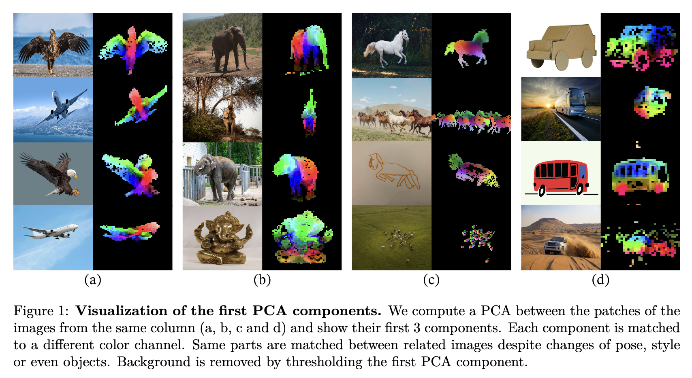
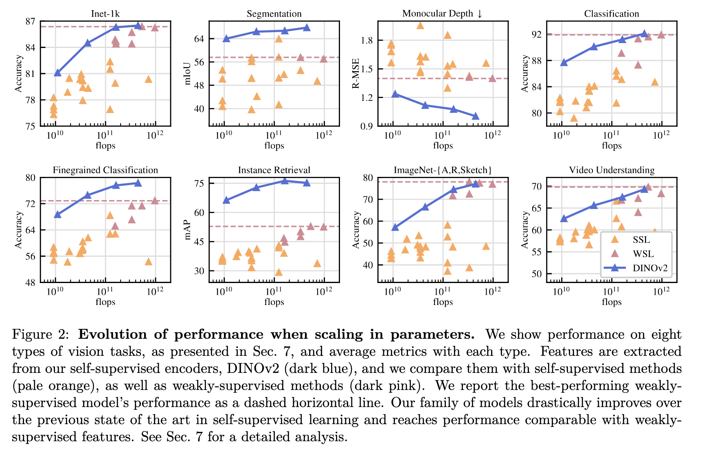
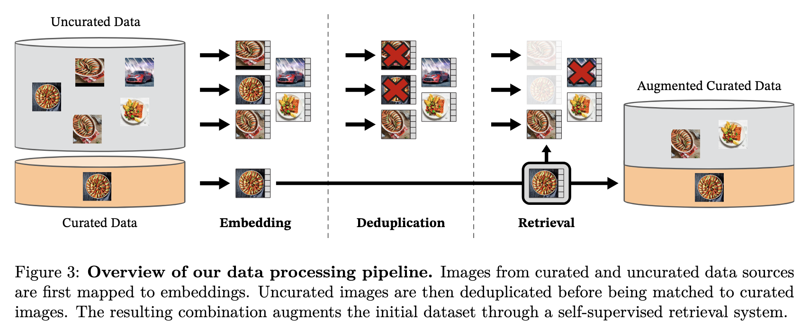
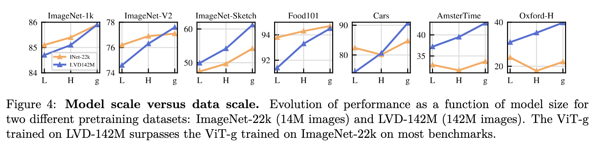

---

# 图像（Figures 1–10）详解

---

### **Figure 1：PCA 可视化揭示语义一致性**

- **位置**：第 2 页
- **内容**：对图像 patch 特征做 PCA，前三主成分映射为 RGB 通道。
- **目的**：展示 DINOv2 特征在不同图像之间的语义一致性。
- **解读**：即使图像在姿态、风格或物体上不同，相同语义区域的 patch 仍被映射到相似的特征空间。
- **作用**：证明 DINOv2 能在无监督下学习到结构化、语义一致的局部特征。

---

### **Figure 2：模型规模扩展对多任务性能的影响**

- **位置**：第 3 页
- **内容**：展示 DINOv2 在 8 个视觉任务上的性能随 FLOPs 增长的变化。
- **任务**：ImageNet-1k、ADE20k、ImageNet-A/R/Sketch、Oxford、iNat、Places、视频理解、深度估计。
- **解读**：DINOv2 在所有任务上均优于其他自监督方法，并接近甚至超过弱监督模型。
- **作用**：验证 DINOv2 是真正的视觉基础模型，具备图像级与像素级任务的通用性。

---

### **Figure 3：数据构建管道示意图**

- **位置**：第 4 页
- **内容**：展示从 uncurated 数据中检索增强 curated 数据的流程，包括嵌入、去重、匹配。
- **解读**：通过自监督特征提取器对图像进行嵌入，使用视觉相似性进行检索，无需标签或元数据。
- **作用**：说明如何构建高质量的 LVD-142M 数据集，是 DINOv2 成功的关键基础。

---

### **Figure 4：ImageNet-1k 上不同模型的线性与 k-NN 性能对比**

- **位置**：第 8 页
- **内容**：展示 DINOv2 与 iBOT、DINO、MAE 等模型在 ViT-L 架构下的表现。
- **解读**：DINOv2 在 k-NN 和线性分类上均优于其他方法，尤其在无需微调的 k-NN 评估中表现突出。
- **作用**：验证 DINOv2 特征的判别性和迁移能力。

---

### **Figure 5：ADE20k 分割任务上的像素级性能对比**

- **位置**：第 9 页
- **内容**：展示不同模型在 ADE20k 数据集上的 mIoU 表现。
- **解读**：DINOv2 在无需微调的情况下也能取得接近监督模型的性能。
- **作用**：支持 DINOv2 在像素级任务上的通用性和结构感知能力。

---

### **Figure 6：Oxford 图像检索任务上的 mAP 对比**

- **位置**：第 9 页
- **内容**：比较 DINOv2 与其他模型在 Oxford 数据集上的 mAP。
- **解读**：DINOv2 特征在检索任务中表现优异，结构信息保留充分。
- **作用**：验证 patch-level 表征的语义一致性和检索能力。

---

### **Figure 7：ImageNet-A/R/Sketch 上的鲁棒性评估**

- **位置**：第 10 页
- **内容**：比较模型在挑战性数据集上的准确率。
- **解读**：DINOv2 在这些分布外数据集上表现稳定，优于其他自监督方法。
- **作用**：强调模型的泛化能力和抗分布偏移能力。

---

### **Figure 8：视频理解任务上的准确率对比**

- **位置**：第 10 页
- **内容**：展示 DINOv2 在视频分类任务上的准确率。
- **解读**：即使未专门为视频训练，DINOv2 特征仍具迁移性。
- **作用**：支持其在时序任务中的应用潜力。

---

### **Figure 9：单目深度估计任务上的误差对比**

- **位置**：第 10 页
- **内容**：比较不同模型在深度估计任务上的 R-MSE。
- **解读**：DINOv2 特征能捕捉空间结构，误差低于其他自监督方法。
- **作用**：验证其在几何任务中的表现。

---

### **Figure 10：Places205 场景识别任务上的准确率对比**

- **位置**：第 10 页
- **内容**：展示 DINOv2 与其他模型在场景分类任务上的表现。
- **解读**：DINOv2 特征能捕捉场景结构，适用于环境理解任务。
- **作用**：验证其在非物体中心任务中的适应性。

---

# 📋 表格（Tables 1–14）详解

---
