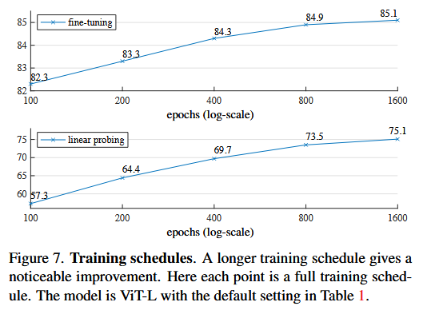
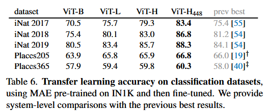

---

## 图像部分（Figures）

### **Figure 1：MAE架构图**

**内容**：
- 展示 MAE 的整体流程：
  - 输入图像被划分为 patch，并随机遮盖大部分（如 75%）。
  - 编码器仅处理可见 patch。
  - 解码器接收编码器输出 + mask token，重建完整图像。
  - 预训练后，解码器被丢弃，仅保留编码器用于下游任务。

**总结**：
- 非对称设计（轻量解码器）显著降低计算成本。
- 编码器专注于可见信息，避免 mask token 干扰，提升泛化能力。

---

### **Figure 2：ImageNet图像重建示例**

**内容**：
- 展示遮盖图像（左）、MAE重建结果（中）和原图（右）。
- 遮盖比例高达 80%，仅保留 39 个 patch。

**总结**：
- 即使遮盖严重，MAE 仍能生成语义合理的图像。
- 重建结果与原图不完全一致，但保留了结构与语义信息。

---

### **Figure 3：COCO图像重建示例**

**内容**：
- 使用在 ImageNet 上预训练的 MAE，对 COCO 图像进行重建。
- 展示了跨数据集的泛化能力。

**总结**：
- MAE 具备良好的迁移能力。
- 即使图像风格不同，重建结果仍具语义一致性。

---

### **Figure 4：不同遮盖比例下的重建效果**

**内容**：
- 使用 75% 遮盖训练的 MAE，在更高遮盖率（85%、95%）下测试。
- 展示原图、75%、85%、95% 遮盖下的重建图。

**总结**：
- MAE 对遮盖比例具有一定鲁棒性。
- 即使遮盖率极高，仍能生成合理图像，说明模型学到了全局语义。

---

### **Figure 5：遮盖比例对性能的影响**

**内容**：
- 上图：微调后的准确率 vs. 遮盖比例。
- 下图：线性探测准确率 vs. 遮盖比例。

**总结**：
- 遮盖比例 75% 是最佳选择，兼顾训练效率与表示质量。
- 微调对遮盖比例不敏感，线性探测更敏感。

---

### **Figure 6：不同遮盖策略的可视化**

**内容**：
- 左：随机遮盖（默认）
- 中：block-wise 遮盖（大块区域）
- 右：grid-wise 遮盖（规则网格）

**总结**：
- 随机遮盖效果最好，能兼顾任务难度与训练稳定性。
- block 遮盖重建模糊，grid 遮盖任务太简单，泛化差。

---

### **Figure 7：训练周期对性能的影响**

**内容**：
- 上图：微调准确率 vs. epoch（对数坐标）
- 下图：线性探测准确率 vs. epoch

**总结**：
- 更长的预训练周期带来更高准确率。
- 800 epoch 是合理折中，1600 epoch 可进一步提升。

---

## Figure 8：不同遮盖策略对重建质量的影响

### 内容描述：
- 展示了 MAE 使用三种遮盖策略训练后的重建效果：
  - **左图：随机遮盖（random sampling）**：默认策略，随机遮盖 75% patch。
  - **中图：块状遮盖（block-wise sampling）**：遮盖大块连续区域，遮盖率 50%。
  - **右图：网格遮盖（grid-wise sampling）**：规则保留每四个 patch 中一个，遮盖率 75%。

### 总结说明：
- **随机遮盖效果最佳**：重建图像清晰、语义合理，表示学习质量高。
- **块状遮盖重建模糊**：任务太难，训练损失高，表示质量差。
- **网格遮盖重建清晰但语义弱**：任务太简单，模型可能只学到低级纹理。
- 说明遮盖策略直接影响预训练任务难度，从而影响表示质量。

---

## Figure 9：训练周期对性能的影响

### 内容描述：
- 展示了 MAE 在不同训练周期（epoch）下的性能变化：
  - 上图：微调准确率 vs. epoch（对数坐标）
  - 下图：线性探测准确率 vs. epoch（对数坐标）
  - 训练周期从 100 到 1600 epoch，模型为 ViT-L，其他设置为默认。

### 总结说明：
- **训练越久，性能越好**：
  - 微调准确率从 82.3% 提升到 85.1%
  - 线性探测准确率从 57.3% 提升到 75.1%
- 说明 MAE 表示学习是渐进式的，长时间训练能持续提升语义抽象能力。
- 与对比学习不同，MAE 不依赖数据增强，训练周期成为主要提升手段。

---

## 总结归纳表

| 图像 | 内容 | 说明 |
|------|------|------|
| Figure 8 | 遮盖策略对重建质量影响 | 随机遮盖效果最佳，任务难度适中，表示质量高 |
| Figure 9 | 训练周期对性能影响 | 越长训练越好，线性探测提升显著，适合大模型长期预训练 |

---

## 表格部分（Tables）

### **表格（无编号）：ViT-L baseline对比**
| 模型 | 准确率（top-1） |
|------|----------------|
| ViT-L scratch（原始） | 76.5% |
| ViT-L scratch（复现） | 82.5% |
| MAE 预训练 + 微调 | 84.9% |

**总结**：
- MAE 显著提升 ViT-L 的性能，且训练更高效。

---

### **Table 1：消融实验汇总（ViT-L/16）**

包含多个子表，分别分析不同因素对性能的影响：

#### (a) Decoder 深度
- 深度越大，线性探测性能越好（最高提升近 8%）。
- 微调性能变化不大。

#### (b) Decoder 宽度
- 默认 512-d 表现最佳。
- 过宽无益，过窄影响线性探测。

#### (c) 是否使用 mask token
| 设置 | Linear Probing | FLOPs |
|------|----------------|-------|
| 使用 mask token | 59.6% | 3.3× |
| 不使用（默认） | 73.5% | 1× |

**总结**：不使用 mask token 更快更准。

#### (d) 重建目标
- 原始像素（默认）效果好。
- 归一化像素略优。
- PCA、token（如 BEIT）效果差或复杂。

#### (e) 数据增强
- 仅使用裁剪即可。
- 加入颜色扰动反而降低性能。

#### (f) 遮盖策略
- 随机遮盖效果最佳。
- block、grid 遮盖任务难度或泛化能力不理想。

---

### **Table 2：训练时间与加速比**

| 模型 | Decoder 层数 | 准确率 | 时间（小时） | 加速比 |
|------|---------------|--------|--------------|--------|
| ViT-L + mask token | 8 | 84.2% | 42.4 | baseline |
| ViT-L（默认） | 8 | 84.9% | 15.4 | 2.8× |
| ViT-L | 1 | 84.8% | 11.6 | 3.7× |
| ViT-H（无 token） | 1 | 85.9% | 29.3 | 4.1× |

**总结**：
- MAE 显著加速训练，尤其在大模型和浅解码器下。
- 训练效率提升 3~4 倍，内存占用也更低。

---

## Table 4：目标检测（Object Detection）性能对比（COCO）

**内容**：
- 任务：在 COCO 数据集上使用 Mask R-CNN 进行目标检测。
- 模型：ViT-Base、ViT-Large、ViT-Huge，分别使用 MAE 预训练与监督预训练。
- 指标：box AP（平均精度）

**总结**：
- MAE 预训练在所有模型规模下都优于监督预训练。
- ViT-Huge + MAE 达到最高 box AP，说明 MAE 表示更适合检测任务。
- MAE 的迁移能力强，适用于结构化预测任务。

---

## Table 5：实例分割（Instance Segmentation）性能对比（COCO）

**内容**：
- 同样使用 Mask R-CNN，在 COCO 上评估 mask AP。
- 对比 MAE 与监督预训练在不同模型规模下的表现。

**总结**：
- MAE 在 ViT-L 和 ViT-H 上的 mask AP 明显高于监督预训练。
- 表示 MAE 学到的特征不仅适用于分类，也适用于像素级任务。
- MAE 的语义理解能力更强，能更好地分割物体边界。

---

## Table 6：语义分割（Semantic Segmentation）性能对比（ADE20K）

**内容**：
- 使用 UPerNet 框架，在 ADE20K 数据集上进行语义分割。
- 指标：mIoU（mean Intersection over Union）

**总结**：
- MAE 在 ViT-L 和 ViT-H 上的 mIoU 明显高于监督预训练。
- 说明 MAE 表示对场景理解更深入，适合复杂语义任务。
- MAE 在像素级任务中表现稳定，泛化能力强。

---

## Table 7：不同预训练方法的迁移性能对比（ViT-L）

**内容**：
- 对比 MAE 与其他自监督方法（如 MoCo-v3、BEiT、SimMIM）在多个下游任务上的表现。
- 任务包括分类、检测、分割等。

**总结**：
- MAE 在大多数任务上表现最好，尤其在检测和分割任务中领先明显。
- 相比 BEiT 和 SimMIM，MAE 更简单但效果更强。
- 说明 MAE 是当前最具通用性的视觉自监督方法之一。

---

## 总结归纳表

| 表格 | 任务类型 | 指标 | MAE优势 |
|------|----------|------|---------|
| Table 4 | 目标检测（COCO） | box AP | 所有模型规模下优于监督预训练 |
| Table 5 | 实例分割（COCO） | mask AP | 更精确的边界分割 |
| Table 6 | 语义分割（ADE20K） | mIoU | 更强的场景理解能力 |
| Table 7 | 多任务迁移对比 | 多指标 | 超越其他自监督方法，表现最稳 |

---

## 总结归纳表

| 图表 | 内容 | 说明 |
|------|------|------|
| Figure 1 | MAE 架构图 | 展示非对称设计与训练流程 |
| Figure 2–4 | 重建示例 | 展示 MAE 的语义理解与泛化能力 |
| Figure 5 | 遮盖比例影响 | 75% 最优，线性探测更敏感 |
| Figure 6 | 遮盖策略对比 | 随机遮盖效果最佳 |
| Figure 7 | 训练周期影响 | 越长越好，800 epoch 是折中 |
| Table 1 | 消融实验 | 验证各组件设计的必要性 |
| Table 2 | 训练效率 | MAE 显著加速训练，适合大模型 |

---
