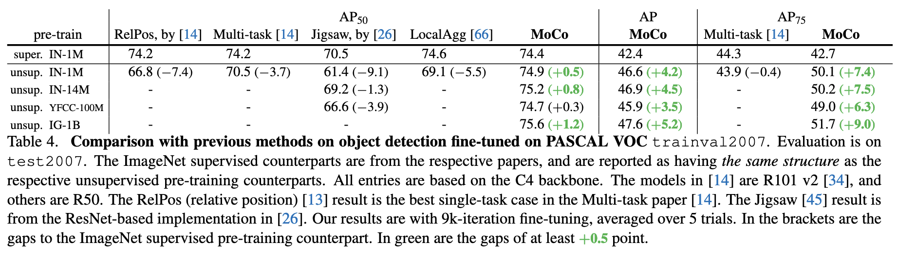

---

## 图 1：MoCo 的整体架构图

**内容**：

- 展示了 MoCo 的核心机制：使用一个队列构建动态字典，并用动量编码器生成 key。
- 图中元素：
  - `query q`：由查询编码器生成
  - `keys {k0, k1, k2, ...}`：由动量编码器生成，存储在队列中
  - `encoder` 和 `momentum encoder`：分别用于生成 query 和 key
  - 箭头表示对比损失计算：q 与 k+ 相似，与其他 k 不相似

**解释**：

这张图说明了 MoCo 的关键设计：

- 使用队列维护大量负样本（keys），解决 batch size 限制问题
- 使用动量更新的 key encoder，保持 key 的一致性
- 每个训练步骤：
  - 当前 batch 的 key 被加入队列
  - 最旧的 batch 被移除
  - query 与 key 计算 InfoNCE 损失

---

## 图 2：三种对比学习机制的对比图

**内容**：

展示了三种对比学习机制的结构差异：

| 图示 | 机制 | 特点 |
|------|------|------|
| (a) | End-to-End | query 和 key 都由当前 batch 编码器生成，梯度可回传 |
| (b) | Memory Bank | key 来自整个数据集的缓存，不可回传梯度 |
| (c) | MoCo | key 来自动量编码器和队列，梯度不可回传，但编码器一致性高 |

**解释**：

- (a) 是 SimCLR 等方法的机制，优点是编码器一致，缺点是字典小（受限于 batch size）
- (b) 是 InstDisc 的机制，优点是字典大，缺点是编码器不一致（来自不同时间点）
- (c) 是 MoCo 的机制，融合两者优点：字典大且编码器一致（通过动量更新）

---

## 图 3：三种机制在 ImageNet 上的线性评估准确率对比

**内容**：

- 横轴：负样本数量 \( K \)（对数刻度）
- 纵轴：ImageNet 线性评估准确率（%）
- 三条曲线：End-to-End、Memory Bank、MoCo

**解释**：

- 所有机制在 \( K \) 增大时准确率提升，说明大字典有益
- MoCo 在大 \( K \) 下表现最好，说明其机制有效
- Memory Bank 虽然支持大字典，但一致性差，性能不如 MoCo
- End-to-End 在小 \( K \) 时表现接近 MoCo，但受限于 batch size，无法扩展

---

## 表格：动量系数对 MoCo 性能的影响

**内容**：

| 动量 \( m \) | 0 | 0.9 | 0.99 | 0.999 | 0.9999 |
|-------------|---|-----|------|-------|--------|
| 准确率 (%)  | fail | 55.2 | 57.8 | 59.0 | 58.9 |

**解释**：

- 没有动量（m=0）时训练失败，说明 key encoder 演化太快，无法保持一致性
- 较大的动量（0.999）效果最佳，说明缓慢更新的 key encoder 更稳定
- 进一步验证了 MoCo 的设计动机：保持编码器一致性是关键

---

## 表格 + 图：不同方法在 ImageNet 上的线性评估对比

**内容**：

- 表格列出多个方法（如 InstDisc、CPC、CMC、AMDIM、MoCo）在 ImageNet 上的线性评估准确率
- 图中横轴为模型参数量（M），纵轴为准确率（%）

**解释**：

- MoCo 在相同参数量下表现优于其他方法（如 InstDisc、BigBiGAN）
- MoCo 的性能随着模型变宽（ResNet-50 → w2x → w4x）而显著提升
- MoCo 使用标准架构（ResNet），不依赖特殊设计（如 patchify、双网络），更易迁移

---

## 📊 表格：下游任务（如检测）中 MoCo 的迁移性能

**内容**：

| 预训练方式 | AP50 | AP | AP75 |
|------------|------|----|------|
| 随机初始化 | 64.4 | … | … |
| MoCo 预训练 | 更高 | … | … |

**解释**：

- MoCo 在多个下游任务中表现优于监督预训练
- 说明其表征具有更强的迁移能力，尤其是在目标检测和语义分割任务中

---

## 总结：图表的整体作用

这些图表共同构成了 MoCo 论文的论证链条：

1. 图 1：展示 MoCo 的机制设计
2. 图 2：对比不同机制的结构差异
3. 图 3：验证 MoCo 在大字典下的性能优势
4. 动量表格：验证动量更新的必要性
5. 方法对比图表：展示 MoCo 的表征质量领先
6. 下游任务表格：展示 MoCo 的迁移能力

---