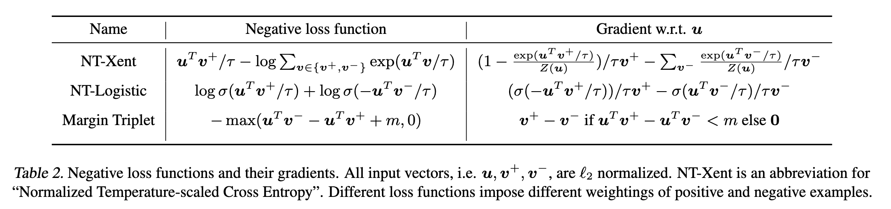

---

### Figure 1：ImageNet Top-1 Accuracy 对比图

**内容**：展示了不同自监督方法在 ImageNet 上的线性评估准确率（Top-1 Accuracy），横轴是模型参数量，纵轴是准确率。

**关键点**：
- SimCLR 在不同规模（1x, 2x, 4x）下均优于其他方法（如 MoCo, PIRL, AMDIM）。
- SimCLR (4x) 几乎达到监督学习 ResNet-50 的水平。
- 说明 SimCLR 在自监督学习中具有极强的表示学习能力。

---

### Figure 2：SimCLR 框架结构图

**内容**：展示 SimCLR 的四个核心组件：
1. 数据增强：对同一图像生成两个不同视图。
2. 编码器 f(·)：提取表示 h。
3. 投影头 g(·)：将 h 映射到对比空间 z。
4. 对比损失：最大化正对之间的相似度，最小化负对。

**关键点**：
- 训练时使用 g(h) 计算对比损失。
- 下游任务使用 h（而非 z）作为最终表示。

---

### Figure 3：对比任务的视图类型示意图

**内容**：
- (a) 展示了全局视图与局部视图的对比（如图像整体 vs 局部区域）。
- (b) 展示了相邻视图之间的对比（如两个相邻patch）。

**关键点**：
- 简单的数据增强（如随机裁剪）就能自动生成多种对比任务。
- 不需要复杂的架构设计（如固定 receptive field）。

---

### Figure 4：数据增强操作示意图

**内容**：展示了论文中研究的各种数据增强方式，包括：
- 空间变换：裁剪、旋转、cutout。
- 外观变换：颜色扰动、高斯模糊、Sobel滤波等。

**关键点**：
- SimCLR 使用的是裁剪 + 颜色扰动 + 高斯模糊。
- 强增强对 contrastive learning 至关重要。

---

### Figure 5：不同数据增强组合的效果热力图

**内容**：横纵轴是不同的数据增强操作，单独或组合使用后的 ImageNet Top-1 准确率。

**关键点**：
- 单一增强效果有限。
- 裁剪 + 颜色扰动组合效果最佳。
- 组合增强能显著提升表示质量。

---

### Figure 6：颜色直方图对比图

**内容**：展示了两个图像在不同裁剪下的颜色直方图，分别在无颜色扰动和有颜色扰动下。

**关键点**：
- 没有颜色扰动时，不同裁剪的颜色分布相似，容易被模型“投机取巧”。
- 加入颜色扰动后，模型必须学习更鲁棒的语义特征。

---

### Table 1：不同颜色扰动强度下的准确率

| 方法 | 1/8 | 1/4 | 1/2 | 1 | 1(+Blur) | AutoAug |
|------|-----|-----|-----|----|----------|---------|
| SimCLR | 59.6 | 61.0 | 62.6 | 63.2 | 64.5 | 61.1 |
| Supervised | 77.0 | 76.7 | 76.5 | 75.7 | 75.4 | 77.1 |

**关键点**：
- SimCLR 对颜色扰动强度非常敏感，越强效果越好。
- 对比学习比监督学习更依赖强增强。
- AutoAugment 对 SimCLR 效果不如简单增强组合。

---

### 🧱 Figure 7：模型规模对性能的影响

**内容**：展示不同深度和宽度的 ResNet 模型在 SimCLR 下的线性评估准确率。

**关键点**：
- 更深更宽的模型带来更好性能。
- 自监督学习比监督学习更能从大模型中受益。

---

### Table 2：不同对比损失函数及其梯度

| 名称 | 损失函数 | 梯度表达式 |
|------|----------|------------|
| NT-Xent | 标准对比交叉熵 | 最优 |
| NT-Logistic | 对数似然 | 表现较差 |
| Margin Triplet | 三元组损失 | 需半难负样本挖掘 |

**关键点**：
- NT-Xent（SimCLR默认）效果最好。
- 温度参数和归一化对性能影响显著。

---

### Figure 8：不同投影头结构对性能的影响

**内容**：比较无投影、线性投影、非线性投影对表示质量的影响。

**关键点**：
- 非线性投影（MLP）效果最好。
- 表征层 h 比投影层 z 更适合下游任务。

---

### Table 3：h vs g(h) 的信息保留能力

| 任务 | 随机猜测 | h | g(h) |
|------|-----------|----|------|
| 彩色 vs 灰度 | 80 | 99.3 | 97.4 |
| 旋转角度 | 25 | 67.6 | 25.6 |
| 原图 vs 噪声 | 50 | 99.5 | 59.6 |
| 原图 vs Sobel | 50 | 96.6 | 56.3 |

**关键点**：
- h 保留更多信息，适合下游任务。
- g(h) 更“抽象”，适合对比损失。

---

### Table 4：不同损失函数的最终准确率

| Margin | NT-Logi | Margin(sh) | NT-Logi(sh) | NT-Xent |
|--------|---------|------------|-------------|---------|
| 50.9 | 51.6 | 57.5 | 57.9 | 63.9 |

**关键点**：
- NT-Xent 明显优于其他损失函数。
- 半难负样本挖掘虽有效，但不如温度调节。

---

### Table 5：温度参数与归一化对性能的影响

| 是否归一化 | τ | Entropy | Contrastive acc. | Top-1 |
|-------------|----|---------|------------------|--------|
| Yes | 0.1 | 4.5 | 87.8 | 64.4 |
| Yes | 0.5 | 8.2 | 68.2 | 60.7 |
| No | 10 | 0.5 | 91.7 | 57.2 |

**关键点**：
- 归一化 + 合适温度（如 τ=0.1）效果最佳。
- 温度调节影响对比学习的难度与泛化能力。

---

### Figure 9：不同 batch size 与训练 epoch 的影响

**内容**：展示不同 batch size 和训练轮数对 SimCLR 表示质量的影响。

**关键点**：
- 更大 batch size → 更多负样本 → 更好性能。
- 长时间训练（如1000 epochs）显著提升性能。

---