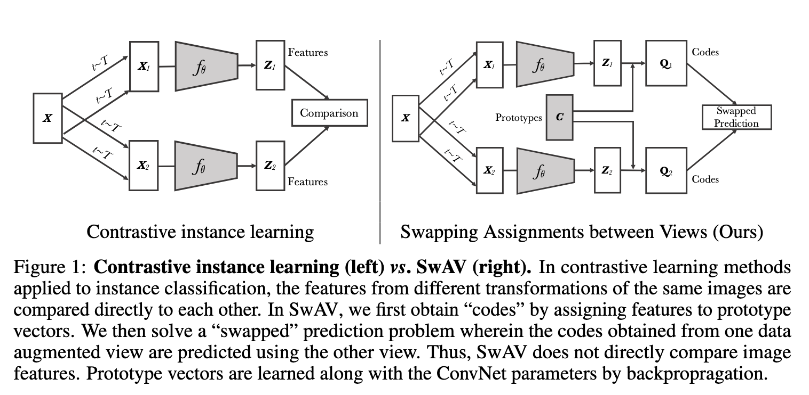
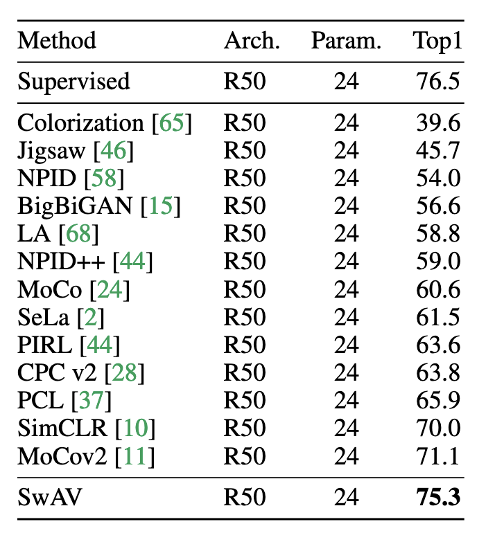
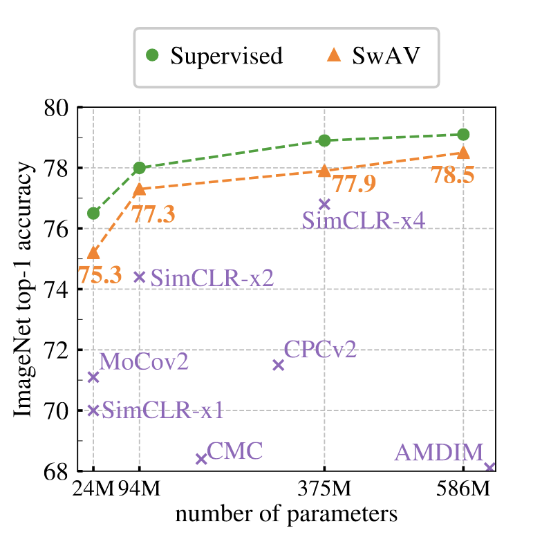
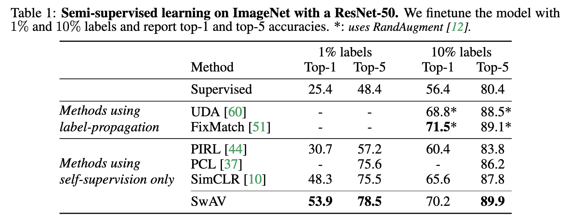
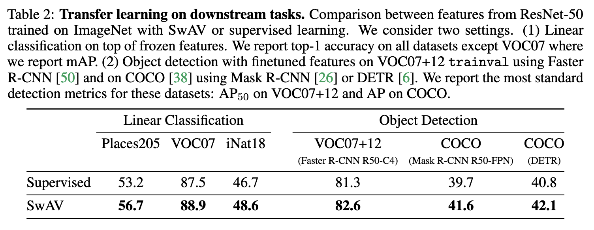
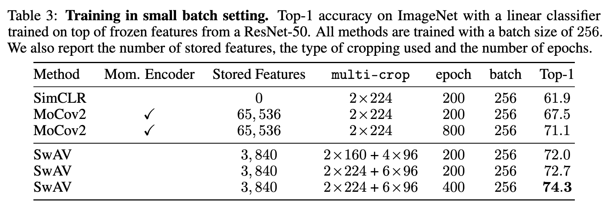
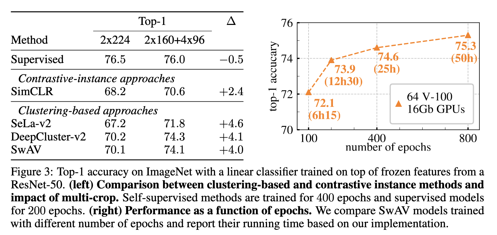

---

# SwAV 论文图表逐一解析与总结

---

## 图 1：对比学习 vs. SwAV 的机制对比图

### 内容说明：
该图对比了传统对比学习（左）与 SwAV（右）的核心机制：

- 左侧（对比学习）：直接比较不同视图的特征向量，拉近正样本、推远负样本。
- 右侧（SwAV）：将特征映射到原型向量，得到“代码”（cluster assignment），然后进行“交换预测”：用一个视图的特征预测另一个视图的代码。

### 总结：
SwAV 的创新在于“对比聚类分配”而非“对比特征”，避免了显式特征对比的计算开销，同时保留了判别性学习的效果。

---

## 表格 1：ImageNet 线性分类性能对比（ResNet-50）

| 方法 | 架构 | 参数量(M) | Top-1 准确率 |
|------|------|-----------|--------------|
| Supervised | R50 | 24 | 76.5% |
| SimCLR | R50 | 24 | 70.0% |
| MoCo v2 | R50 | 24 | 71.1% |
| SwAV | R50 | 24 | 75.3% |

### 总结：
SwAV 在标准 ResNet-50 上取得 75.3% 的 Top-1 准确率，超越所有自监督方法，仅比监督训练低 1.2%，显示出其强大的表征学习能力。

---

## 图 2：不同模型宽度下的 ImageNet 线性评估性能

- 横轴：模型参数量（ResNet-50 的宽度 ×1, ×2, ×4, ×5）
- 纵轴：Top-1 准确率
- 比较对象：SwAV、SimCLR、MoCo、CPCv2、Supervised

### 总结：
随着模型宽度增加，SwAV 的性能持续提升，最终在 ResNet-50 ×5 上达到 78.5%，进一步缩小与监督训练的差距，验证了其可扩展性。

---

## 表格 2：ImageNet 半监督学习性能（1% 和 10% 标签）

| 方法 | 1% Top-1 | 1% Top-5 | 10% Top-1 | 10% Top-5 |
|------|----------|----------|-----------|-----------|
| Supervised | 25.4 | 48.4 | 56.4 | 80.4 |
| SimCLR | 48.3 | 75.5 | 65.6 | 87.8 |
| SwAV | 53.9 | 78.5 | 70.2 | 89.9 |

### 总结：
SwAV 在极少标签的半监督场景下表现优异，显著优于 SimCLR 和监督训练，显示其在低资源环境下的实用性。

---

## 表格 3：下游任务迁移性能对比（分类 + 检测）

| 任务 | SwAV | Supervised |
|------|------|------------|
| Places205 分类 | 56.7% | 53.2% |
| VOC07 分类 | 88.9% | 87.5% |
| iNat18 分类 | 48.6% | 46.7% |
| VOC07+12 检测 | 82.6% | 81.3% |
| COCO 检测（Mask R-CNN） | 41.6% | 39.7% |
| COCO 检测（DETR） | 42.1% | 40.8% |

### 总结：
SwAV 是首个在所有下游任务上全面超越监督预训练的自监督方法，验证了其表征的通用性和迁移能力。

---

## 表格 4：小批量训练性能对比（Batch=256）

| 方法 | 动量编码器 | 存储特征数 | Multi-Crop | Epochs | Top-1 |
|------|-------------|--------------|------------|--------|-------|
| SimCLR | 否 | 0 | 2×224 | 200 | 61.9% |
| MoCo v2 | 是 | 65K | 2×224 | 800 | 71.1% |
| SwAV | 否 | 3.8K | 2×224+6×96 | 400 | 74.3% |

### 总结：
SwAV 在小批量训练下仍保持领先性能，训练效率高，资源消耗低，且无需动量编码器或大型内存库。

---

## 表格 5：不同方法在不同 Multi-Crop 设置下的性能提升

| 方法 | 标准视图 (2×224) | Multi-Crop (2×160+4×96) | 提升 |
|------|------------------|--------------------------|------|
| SimCLR | 68.2% | 70.6% | +2.4% |
| SeLa-v2 | 67.2% | 71.8% | +4.6% |
| DeepCluster-v2 | 70.2% | 74.3% | +4.1% |
| SwAV | 70.1% | 74.1% | +4.0% |

### 总结：
Multi-Crop 策略在多种自监督方法中均带来显著性能提升，SwAV 的设计在该策略下尤为有效，进一步验证了其增强机制的通用性。

---
