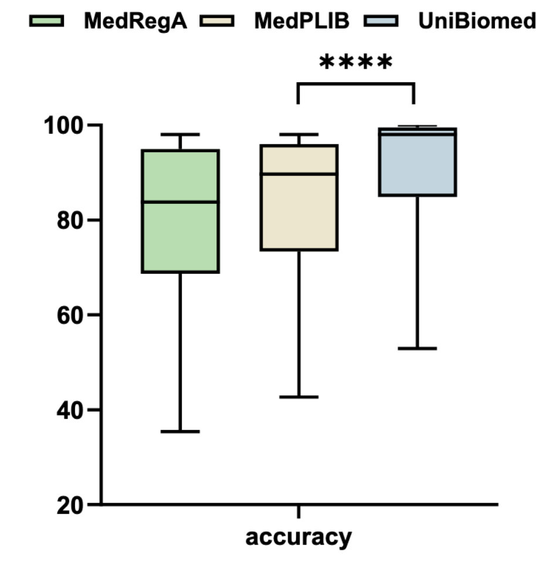

# 什么是显著性
“显著性”是统计学中的一个重要概念，用来判断一个研究结果是否**具有可信度**，也就是说，观察到的差异或关系是否可能是**真实存在的**，而不是**偶然产生的**。

---

### 📌 显著性的核心含义

当我们比较两个方法、两组数据或两个实验结果时，我们会问：

> “这个差异是真的，还是只是随机波动造成的？”

显著性就是用来回答这个问题的工具。

---

### 🧪 如何判断显著性？

我们通常使用 **p 值（p-value）** 来衡量显著性：

| p 值范围       | 显著性水平 | 说明 |
|----------------|------------|------|
| p < 0.05       | 显著       | 有 95% 的把握认为结果不是偶然的 |
| p < 0.01       | 高度显著   | 有 99% 的把握 |
| p < 0.0001     | 极度显著   | 几乎可以确定结果是真实的 |

图中的 “****” 就是表示 p < 0.0001，说明 UniBiomed 和 MedPLIB 的准确率差异非常明显，不太可能是随机造成的。

---

### 🎯 举个例子

假设你在测试两种药物的效果：

- 药物A平均让人退烧时间是 3 天
- 药物B平均是 2.5 天

如果差异很小，可能只是巧合。但如果统计分析告诉你 p < 0.01，那就说明这个差异很可能是真的，药物B确实更有效。

---
# 显著性和置信度的关联和区别
这是一个很好的问题 👍。显著性和置信度在统计学里是相关但不完全相同的概念，可以这样理解：

---

### 🔹 显著性（Significance）
- 用 **p 值** 来衡量。
- p 值表示：在“零假设成立”的情况下，观察到当前差异或更极端差异的概率。
- 如果 p 值很小（例如 < 0.05），说明这种差异极不可能是偶然的，因此我们认为结果“显著”。

---

### 🔹 置信度（Confidence）
- 通常用 **置信区间（Confidence Interval, CI）** 来表示。
- 例如 95% 置信区间，意思是：如果我们重复实验很多次，有 95% 的区间会包含真实值。
- 它强调的是对估计值的**可信范围**，而不是差异是否存在。

---

### 📊 二者关系
- **显著性检验**回答的是：差异是否存在？（是/否）
- **置信区间**回答的是：差异大概有多大？（范围）
- 在很多情况下，显著性和置信度会一起使用。例如：
  - p < 0.05 → 差异显著
  - 同时给出 95% 置信区间 → 说明差异的可能大小范围

---

### 🎯 简单比喻
- **显著性**：告诉你“这枚硬币可能不是公平的”（差异存在）。
- **置信区间**：告诉你“这枚硬币正面出现的概率大概在 0.55–0.65 之间”（差异的范围）。

---

所以，显著性不能直接等同于置信度，但它们是互补的：显著性强调差异是否真实存在，而置信度强调估计值的可靠范围。  
# 箱体图
**箱线图是一种统计图表，用来直观展示数据的分布情况、集中趋势和异常值。它能帮助我们快速理解数据的整体特征。**

---

### 📊 箱线图的组成部分
- **箱体（Box）**：表示数据的中间 50%（从下四分位数 Q1 到上四分位数 Q3）。
- **中位数（Q2）**：箱体中间的横线，代表数据的中心位置。
- **须（Whiskers）**：从箱体延伸的线，通常到达数据的最小值和最大值（不含异常值）。
- **异常值（Outliers）**：落在正常范围之外的点，通常用圆点或星号表示。

---

### 📈 箱线图能告诉我们什么
- **集中趋势**：通过中位数看数据的中心位置。
- **分散程度**：箱体的高度（Q3-Q1）反映数据的波动大小。
- **对称性与偏态**：如果中位数在箱体中心且须长度差不多，说明数据分布对称；否则可能偏斜。
- **异常值检测**：箱线图能直观显示出离群点，帮助发现特殊情况。

---

### 🧪 应用场景
- **科研**：比较不同实验组的结果差异。
- **医学**：分析不同治疗方法的效果分布。
- **工业**：质量控制，检测生产数据中的异常。
- **教育/社会科学**：比较不同群体的成绩或调查结果。
---

### 🧠 总结
箱线图的优势在于 **信息量大、直观易懂**，它不仅能展示数据的整体分布，还能揭示异常值和偏态情况，是数据分析中非常常用的工具。  

# 例子：
这张图是一个 **箱线图（Box Plot）**，用来比较三种不同方法在某项任务中的**准确率（accuracy）**表现。我们来逐步解读它的含义：

---

### 📊 图中元素说明

- **Y轴（纵轴）**：表示准确率，范围从 20 到 100。
- **三种方法**：
  - **MedRegA**（绿色）
  - **MedPLIB**（米色）
  - **UniBiomed**（蓝色）

每种方法都有一个箱线图，展示其准确率的分布情况，包括：
- **中位数**（箱体中间的横线）
- **上下四分位数**（箱体的上下边缘）
- **异常值**（箱体外的点）

---

### 📈 结果解读

- **UniBiomed** 的表现最好：
  - 准确率中位数最高
  - 数据波动最小（箱体最窄）
- **MedPLIB** 的准确率次之，但波动较大
- **MedRegA** 的准确率最低，且波动也较大

---

### ⭐ 统计显著性（****）

图中 MedPLIB 和 UniBiomed 之间有一个 “****” 标记，表示这两个方法之间的准确率差异在统计上是**高度显著的**（通常表示 p 值 < 0.0001）。

---

### 🧠 总结

这张图说明在比较的三种方法中，**UniBiomed 在准确率方面明显优于其他两种方法**，且结果稳定可靠。

如果你想了解这些方法具体是做什么的，或者图背后的研究背景，我可以帮你查找更多资料！