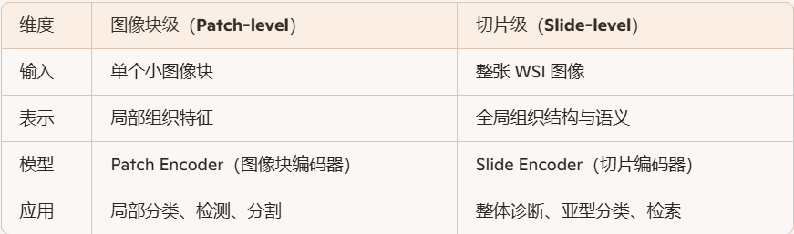
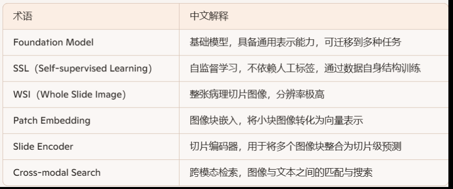

# Multimodal Whole Slide Foundation Model for Pathology
## 图像块和切片级区别
### 什么是图像块（Patch）
    图像块是从整张病理切片图像（WSI）中裁剪出来的小区域。 每个图像块通常是固定大小的，比如 256×256 或 512×512 像素。
    由于 WSI 图像非常大（可能达到几十万像素），无法直接输入神经网络，所以必须先切成图像块。
    每个图像块可以被单独编码，提取出组织结构、细胞形态等特征。
    类比理解： 就像你把一张地图切成很多小方格，每个方格就是一个图像块。
### 什么是切片级（Slide-level）
    切片级是指整张病理图像的整体表示，不是某个局部区域。
    切片级模型的目标是将所有图像块的特征整合起来，形成一个能代表整张图像的嵌入向量。
    这个表示可以用于诊断、分类、检索等任务，比如判断整张切片是否为癌症、属于哪种亚型。
    类比理解： 就像你根据整张地图的所有方格信息，判断这是哪个城市、地形类型或气候区。
### 区别对比

## 
## 什么是ROI图像块
### ROI 是 “Region of Interest” 的缩写，意思是 感兴趣区域。 在病理图像中，ROI 图像块指的是从整张病理切片图像（WSI）中裁剪出的、包含关键病理信息的小区域。
## 什么是嵌入空间（Embedding Space）
### 嵌入空间是指将原始数据（如图像、文本、音频等）转换成向量表示后所处的数学空间。这些向量捕捉了数据的语义、结构或模式，使得模型可以在这个空间中进行计算、分类、检索等任务。
## 什么是iBOT框架（Image BERT Pretraining with Online Tokenizer）
### iBOT是一种用于图像自监督学习的框架，由 Meta AI 提出，主要用于训练 Vision Transformer（ViT）模型。它结合了两种关键技术：
#### 1.掩码图像建模（Masked Image Modeling）
    类似于 BERT 在文本中的做法，iBOT 会随机遮盖图像的一部分，然后训练模型去“恢复”这些被遮盖的区域。
    这样可以让模型学会理解图像的结构和语义。
#### 2.知识蒸馏（Knowledge Distillation）
    使用一个“教师模型”指导“学生模型”学习更好的表示。
    教师模型通常是一个训练好的模型，学生模型通过模仿它的输出来提升性能。
## 自注意力机制和交叉注意力机制
### 自注意力是指一个序列中的每个元素与该序列中的所有其他元素进行交互，以捕捉上下文信息。
    每个位置都“关注”整个序列，决定自己应该从哪些位置获取信息。
### 交叉注意力是指一个序列（如查询序列）关注另一个序列（如上下文或条件序列），以融合外部信息。
    查询来自一个模态或任务，键值来自另一个模态或任务。
    机制	          信息流动	      应用场景	                 举例
    自注意力	    序列内部交互	      表征学习、上下文建模	    BERT、ViT、PAST图像编码器
    交叉注意力	序列间交互	      条件生成、模态融合	        Transformer解码器、SAM、PAST表达预测模块
## CONCH和CONCHv1.5区别
    维度	                CONCH	                CONCHv1.5
    底层架构	                ViT-B	                ViT-L（更大模型容量）
    初始化方式	        从头训练	                从 UNI 模型 checkpoint 恢复
    预训练数据	        117 万图像-标题对	        同样数据，但可能使用更强策略
    训练策略	                对比学习（图像-文本）	同样对比学习，但可能加入 gated prompt 或更强正则化
    性能表现	           在14项病理任务中表现优异	        在多个任务上进一步提升，尤其在细粒度分类和检索任务上更强
    模型容量	               Base级别（ViT-B）  	Large级别（ViT-L），参数更多，表征能力更强
    使用限制	             开源、非商业研究使用	        需注册并通过机构邮箱验证，限制更严格
## COCA预训练
### 什么是COCA
#### CoCa（Contrastive Captioner）是一种联合对比学习 + 生成学习的预训练策略，融合了 CLIP 式对比学习和 caption 式语言建模。
#### 它的目标是让模型既能：
    对齐图像与文本（对比学习）；
    生成描述性文本（语言建模）。
### COCA的核心机制
    模块	                     功能	                          说明
    图像编码器	            提取图像特征	            通常为 ViT 或 CNN backbone
    文本编码器 / 解码器	    编码或生成文本	    Transformer结构，支持双任务
    对比头	                     图像-文本对齐	    类似 CLIP，优化 InfoNCE 损失
    生成头	                     文本生成	            类似 captioning，优化语言建模损失

## 什么是免疫组化（IHC）？
### 免疫组化是一种实验技术，用于在组织切片中检测特定蛋白质的表达和定位。它通过抗体与目标抗原（通常是蛋白质）特异性结合，并通过染色显色，使得目标分子在显微镜下可视化。
## H&E染色是什么？
### 几乎所有病理AI模型（如 ResNet、CTransPath、PAST）都以 H&E 图像作为输入。
    H&E 是“形态学之眼”，而 IHC 是“分子之眼”，两者结合才能实现精准病理分析。
    维度	             H&E染色	           IHC染色
    染色原理	             化学染料	       抗体识别特定蛋白
    显示内容	         组织结构、细胞形态	蛋白表达、分子定位
    应用场景	         常规诊断、组织学观察	分子分型、靶向治疗决策
    成本与复杂度	    低成本、快速	         高成本、技术复杂
    AI建模角色	   图像输入主力	       目标预测对象（如虚拟IHC）
## 空间转录组重建（Spatial Transcriptomic Reconstruction）是指在没有直接测量基因表达的情况下，利用其他信息（如组织图像）来推测组织中每个细胞或位置的基因表达谱，从而“重建”出空间转录组图谱。
## 细胞异质性（Cellular Heterogeneity）是指在同一种组织或细胞群体中，不同细胞之间在形态、功能、基因表达、代谢状态等方面存在差异。这种差异可以是微观的，也可以是功能性的，是生物系统复杂性和动态性的核心体现。
## 删失是指在研究结束时，某些个体的事件（如死亡、复发、设备故障）尚未发生，或发生时间无法准确记录，只能知道其发生在某个时间之后或之前。
    类型	                                          说明	                       举例
    右删失（Right-censoring）	      事件尚未发生，但已超过某个时间点	         患者在随访结束时仍存活
    左删失（Left-censoring）	      事件已发生，但发生时间早于观察起点	         患者在入组前已患病
    区间删失（Interval-censoring）  事件发生在两个时间点之间，但具体时间未知	     患者在两次检查之间复发
    随机删失（Random censoring）	  删失时间与事件时间无关	                 随机失访、退出研究等情况
## 空间正则化（Spatial Regularization）是一种在图像处理或计算模型中常用的技术，目的是引导模型在空间维度上保持一致性、平滑性或结构性，从而提升模型的泛化能力和预测质量。

## SAM是怎么做分割的
### 通过用户提供的提示（prompt）来实现对任意图像区域的分割
### SAM由三个主要模块组成：
#### 图像编码器（Image Encoder）
    使用 Vision Transformer（ViT）对输入图像进行编码。
    将高分辨率图像（如1024×1024）转化为低维嵌入（如256×64×64），保留图像的空间和语义信息。
#### 提示编码器（Prompt Encoder）
    支持多种提示类型：点（point）、框（box）、掩码（mask）、文本（text）。
    每种提示都会被编码成与图像嵌入相同维度的向量，便于后续融合。
    稀疏提示（点、框、文本）使用位置编码和类别嵌入；稠密提示（掩码）通过卷积处理成特征图。
#### 掩码解码器（Mask Decoder）
    是一个轻量级的 Transformer 解码器。
    利用图像嵌入和提示嵌入进行交叉注意力计算，生成分割掩码。
    输出多个候选掩码，并为每个掩码分配一个置信度分数（如IoU）
## 什么是自蒸馏学习（Self-Distillation）
### 模型向自己学习，而不是依赖一个更大的教师模型。
### 自蒸馏可以通过以下方式实现：
    使用早期训练的模型版本作为教师；
    利用深层网络的输出指导浅层结构；
    多阶段训练中，前一阶段模型指导后一阶段。