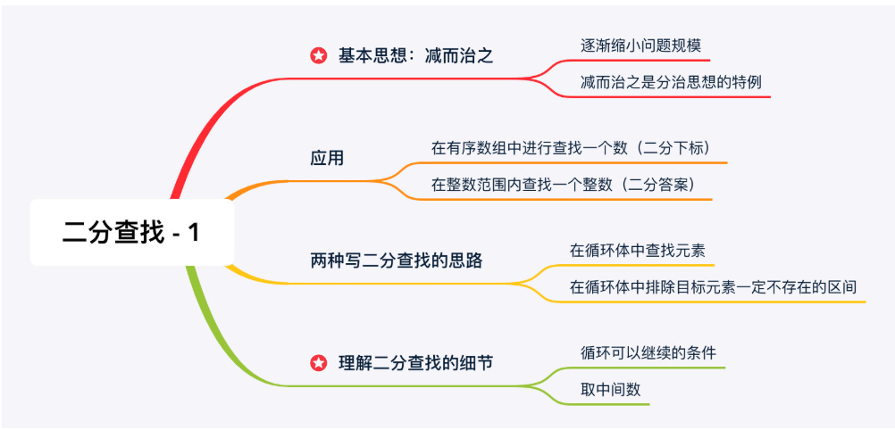

## 一. 二分查找的基本思想
### 1.减而治之的思想

### 2.分治和减治的区别：
	我们把一个问题拆分成若干个子问题以后，应用「减治思想」解决的问题就只在其中一个子问题里寻找答案。

### 3.二分查找法的应用范围，什么时候该用二分查找法
	-有序数组中查找一个数
	-整数范围内查找一个整数

### 4.二分查找法的两种思路：
	思路 1：在循环体中查找元素；
	思路 2：在循环体中排除目标元素一定不存在的区间。

### 5.其实二分查找不一定要求目标元素所在的区间是有序数组，也就是说「有序」这个条件可以放宽，半有序数组或者是山脉数组里都可以应用二分查找算法。
	旋转数组和山脉数组的特点是可以通过当前元素附近的值推测出当前元素一侧的所有元素的性质，也就是说，旋转和山脉数组的值都有规律可循，元素的值不是随机出现的，在这个特点下，「减治思想」就可以应用在旋转数组和山脉数组里的一些问题上。我们可以把这两类数组统一归纳为部分有序数组。

### 6.时间复杂度：二分查找的时间复杂度是 O(logN)

### 7.小tips
	经常见到位运算，int mid = (left + right) >> 1; 这样的写法，这是因为整数右移 1 位和除以 2（向下取整）是等价的，这样写的原因是因为位运算比整除运算要快一点。但事实上，高级的编程语言，对于 / 2 和除以 2 的方幂的时候，在底层都会转化成为位运算，我们作为程序员在编码的时候没有必要这么做，就写我们这个逻辑本来要表达的意思即可，这种位运算的写法，在 C++ 代码里可能还需要注意优先级的问题。
    取中间索引：int mid = left + (right - left) / 2

### 8. 应用排除法来写二分查找时的算法有所不同：
在最后一次循环时， 
如果向下取整，left可能会一直和mid相等，导致left值一直不变，进入死循环，所以，left不能赋值为mid;
如果向上取整，right可能会一直和mid相等，导致right值一直不变，进入死循环，所以，right不能赋值为mid;

    public class Solution {
    public int search(int[] nums, int target) {
        int len = nums.length;
        int left = 0;
        int right = len - 1;
        #一定要严格小于，排除法的解法在left==right时会出现无限循环
        while (left < right) {
            #要向上取整
            int mid = left + (right - left + 1) / 2;
            if (nums[mid] > target) {
                // 下一轮搜索区间是 [left, mid - 1]
                right = mid - 1;
            } else {
                // 下一轮搜索区间是 [mid, right]
                left = mid;
            }
        }

        if (nums[left] == target) {
            return left;
        }
        return -1;
        }
    }
## 二.
### 1. 
