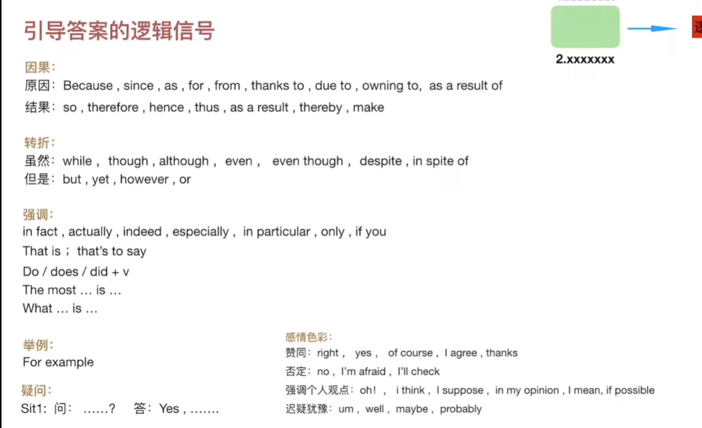

### 四大原则
## 视听一致原则：耳朵听到的信息与眼睛看到的越一致，越容易为正确答案（简单题）
    1.某个选项关键信息与音频内容完全相符
    2.某个选项关键信息在音频中出现次数最多
## 关键词选取
    1.纵向审题：排除相同概念
    2.横向划词：划实不划虚；组合概念（形+名/名+名...）
## 同转概念
    1.同根词
    2.词词替换
    3.短语/概念替换
    4.宽泛到具体 （food→tomato）
## 正确与错误选项的特点
    正确选项：
        1.选项与音频内容一致
        2.符合题目描述
        3.通过逻辑引导答案
    错误选项：
        1.直接被否定
        2.反义表述
        3.部分信息未提及
        4.选项杂糅
